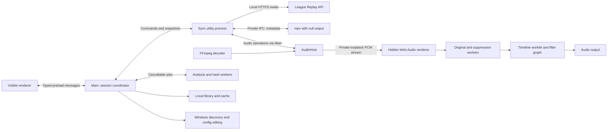

# League replay comms implementation plan

Updated: 2026-10-04. Version 0.3.0 implements the guided recording workflow, automatic playback, sound filters, and fast seeking. Current-League, clean-Windows, and physical-timing acceptance remain open. See [implementation and validation status](tests/acceptance/STATUS.md).

This document records the implemented architecture, product scope, and outstanding acceptance requirements. Source code defines current behavior; the accuracy targets below remain requirements rather than measured capabilities.

Scope revision, 2026-09-30: the user rejected manual replay-file selection and replay-confirmation tasks. Remember timing by recording contents and audio track. Choose the recording explicitly; automatic replay-to-recording lookup is not implemented. Schema 6 implements recording-based timing and preserves earlier replay-keyed data for recovery.

Scope revision, 2026-10-01: retain automatic top-right clock detection and fall directly back to manual anchoring if it fails. Remove video-frame previews and user-selected clock regions. Preserve existing saved alignments and legacy library data.

Scope revision, 2026-10-01: manual anchoring is one editable offset with Back/Forward steps while listening alongside League. Apply and save changes immediately, preserve active listening when opening or closing the editor, and remove waveforms, timestamp-pair anchoring, and independent recording scrubbing. Keep legacy saved offsets and corrections readable.

Scope revision, 2026-10-04: playback begins automatically when recording, selected track, accepted timing, usable audio bounds, and a fresh verified viewer are ready. A temporary API failure preserves the recording association; a verified viewer PID change requires choosing a recording again. Mute silences output without stopping synchronization. Production audio uses FFmpeg and Web Audio with radio voice, noise suppression, and sound positioning; mpv supplies track and timestamp metadata.

The [verification matrix](#13-verification-matrix) defines required coverage. Keep recorded results in [validation status](tests/acceptance/STATUS.md), separate from the requirements here.

Implementation reference:

- [User workflows](#2-user-workflows), [stack](#3-stack-and-repository-layout), and [process boundaries](#4-processes-and-module-interfaces).
- [Replay connection and identity](#6-replay-api-and-active-replay-identity), [playback synchronization](#7-synchronization-controller), and [video alignment](#8-import-and-automatic-video-alignment).
- [Saved recording timing and file identity](#9-library-and-file-identity) and [guided Replay API setup](#10-replay-api-setup).
- [Accuracy criteria](#11-diagnostics-and-acceptance-criteria), [release validation](#12-release-validation), and [open measurement decisions](#14-decisions-to-close-with-measurements).

The fixed design decisions are:

| Concern | Decision |
| --- | --- |
| Application | TypeScript/Electron on Windows; one portable executable with bundled runtime and media/OCR tools |
| Playback | League is the master clock; FFmpeg decodes the selected stream and a hidden Web Audio renderer produces filtered, pitch-preserving audio |
| Alignment | Automatic video-clock analysis with manual correction; manual anchoring for audio-only files |
| Time mapping | One constant recording-to-game offset for continuous, uninterrupted match recordings |
| Remembered reviews | Recording content identity plus track-specific timing, independent of filenames; choose the recording for each new viewer PID |
| Setup | Detect configuration and connectivity separately; offer a backed-up edit on the user's action |
| Release | Demonstrate accuracy and usability on the packaged Windows application; no promise of mathematically perfect synchronization |

## 1. Product and scope

Build a portable Windows companion that plays recorded comms in sync with League's replay viewer. The user seeks, pauses, and changes speed in League; the companion follows those controls. Support continuous recordings of regular ranked/flex matches without pauses in the original match.

The application must:

- Run from one downloaded Windows executable, with all runtime dependencies bundled.
- Accept standalone audio and player POV video containing comms. Play the selected audio track directly from the original file.
- Automatically align video using its visible game timer, with manual alignment and corrections always available.
- Align audio-only files manually, without waiting for automatic analysis.
- Follow replay time, pause/resume, speed changes, forward/backward seeks, and repeated scrubbing without accumulating drift.
- Remember each recording's selected audio track, alignment, manual corrections, and known file locations.
- Recognize byte-identical recordings after renames, moves, or copies. Require choosing a recording when the verified viewer PID changes.
- Detect Replay API configuration and help the user enable it, including an optional automatic config edit.

Outside scope: automatic audio-only anchoring, acoustic fingerprinting, speech recognition, recorder integration, recording-time metadata or sidecars, tournament-pause mapping, and edited/segmented recording timelines. These are not deferred milestones. A synchronized POV video player and simultaneous mixing of several audio tracks are not part of the first release; video frames are decoded internally for automatic alignment.

Never ask users to locate or confirm a `.rofl` file. Missing match identity adds no task; the verified viewer PID is sufficient to bind a chosen recording. Missing viewer identity prevents following until the Replay API supplies it.

Use one constant recording-to-replay offset. Automatic alignment assumes the selected clock tick maps directly to replay time; it does not test the rest of the recording for consistency or drift. Manual correction remains available.

## 2. User workflows

The [guided UI design](UX_DESIGN.md) specifies the accepted finite-state flow with one current task and at most one primary action, including this revised identity policy. The guided UI and recording-based persistence are implemented.

### First review

1. Launch the executable. Detect the League installation, inspect Replay API configuration, and show connection status.
2. If needed, use **Enable replay connection** and restart the replay in League.
3. Connect to the open replay and verify its viewer PID automatically. Match identity is not required.
4. Drop or select a recording, or choose a recent recording. If it has multiple audio tracks and no saved choice, preview and select the comms track.
5. For video, run top-right clock detection and show progress; a failure opens manual alignment directly. For audio, open manual alignment immediately. Manual alignment remains available while video analysis runs.
6. Once all playback prerequisites are ready, bind the chosen recording to the verified viewer PID and follow League automatically. Save timing by recording/track locally. **Mute comms** silences output while keeping volume and synchronization.

### Manual alignment and corrections

Use one offset field for both audio and video, with **Back 0.1 s** and **Forward 0.1 s** controls. Back decreases the offset and moves the recording backward against League; Forward increases it. Arrow Down/Up also adjust it; Shift uses 1-second steps and Alt uses 0.01-second steps. The [guided design](UX_DESIGN.md#manual-alignment-and-live-corrections) owns the editor layout.

The effective mapping remains `recordingSeconds = replaySeconds + offset`. Valid edits apply and persist immediately. Keep local partial input stable across replay updates and delayed acknowledgements. Invalid or out-of-range input never reaches playback. Preserve legacy timing by summing base offset and correction; new manual edits store that single value as the base offset with correction zero.

Entering and leaving the editor preserves active listening. **Done** closes the editor; accepting the initial zero offset is also valid. The controller follows replay playback, pauses, and seeks while edits force synchronization to the new offset. Offline entry remains available, but auditioning the adjustment requires a connected replay. Never pause or seek League automatically.

Manual alignment has no waveform generation/cache, waveform-preview IPC, playhead-pair anchoring, or recording seek controls. Audio-track audition remains available when choosing a track. A late automatic result must never overwrite a manual edit. Video recordings offer **Detect offset from video clock** in Adjust timing, also available as **Read game clock again** in Settings. Detection pauses listening and replaces the offset only on success; failure retains accepted timing.

### Subsequent reviews

Choose or drop the recording, or select it from recent recordings. Verify its identity, restore its track and timing, and follow League automatically when the remaining prerequisites are ready. A renamed or moved file with matching contents reuses saved alignment. A missing recording shows **Locate recording**. Automatic replay-to-recording selection is not implemented; never infer that match association from the last-used file or replay duration. Restored timing establishes a recording-to-game-clock mapping, not proof that the user opened the corresponding match in League.

## 3. Stack and repository layout

Use TypeScript, Electron, a bundled mpv process, FFmpeg/ffprobe, and Tesseract.js with local worker/WASM/language assets. Use electron-builder's Windows portable target. Pin dependency versions and native executable checksums when creating the build; record their licenses and distribution requirements.

Implementation defaults: a small React/TypeScript renderer built with Vite, Vitest for deterministic TypeScript tests, and a versioned JSON library owned by the main process. SQLite is unnecessary for the initial library size. Playback uses the existing FFmpeg/Electron facilities plus pinned `@lofcz/deepfilternet-web` model assets.

Current module layout:

```text
src/
  main/          App lifecycle, session coordination, dialogs, library ownership
  preload/       Narrow, typed renderer interface
  renderer/      Review, alignment, setup, and diagnostics views
  sync/          Utility process, controller, replay and filtered/native engine adapters
  audio/         Web Audio player, processing workers, timeline worklet and filter graph
  analysis/      Import, clock-frame extraction, OCR, hashing workers
  library/       Records, migrations, identity, persistence, relocation
  platform/      Windows installation/process discovery and config editing
  shared/        Serializable messages, domain records, runtime validation
resources/      Bundled media executables, OCR assets, certificate, notices
scripts/        Verified dependency acquisition and packaging
tests/
  fixtures/      Generated media, config variants, and sanitized clock traces
  integration/  Real engine, persistence, IPC, and Windows helper tests
  acceptance/   Measurement tools and real-client test instructions/results
```

Do not copy prior-art source without establishing its reuse license. Implement behavior independently where necessary.

## 4. Processes and module interfaces

The synchronization utility process owns replay observations and controller decisions. `FilteredEngine` sends audio operations through the main process to `AudioHost`, which owns a hidden sandboxed renderer and a private loopback PCM transport. FFmpeg streams the chosen track; the hidden renderer owns preparation, the sample timeline, and audio output. The visible UI, OCR, and hashing do not run the playback loop.



Keep each module's interface small. Its implementation owns lifecycle, ordering, cancellation, and error handling.

| Module | Interface responsibilities | Hidden implementation |
| --- | --- | --- |
| Review session | Select recording/track, manage preview ownership, apply alignment, bind automatically, mute; publish one session snapshot | Viewer PID association, recording-choice guard, job coordination, persistence |
| Replay connection | Start/stop observations; report capabilities, playback samples, and connection errors | HTTPS trust, validation, polling, request deadlines, process-session changes |
| Synchronization | Consume timestamped observations and user intents; emit playback actions and status | Clock estimation, state transitions, jump detection, rate correction, recovery |
| Media engine | Load a track, observe position, pause/resume, set rate, seek, set volume, close | Metadata mpv lifecycle, private PCM transport, Web Audio preparation/output, request IDs and timeouts |
| Media analysis | Probe, decode clock frames, estimate clock alignment, cancel; report progress/evidence | FFmpeg processes, OCR workers, crops, PTS conversion, fitting, cache |
| Library | Resolve recording identity/location, restore track/timing, commit alignment, relocate | Streaming hashes, provisional imports, deduplication, migrations, retained legacy records, crash recovery |
| League setup | Discover installations, inspect config, enable on explicit user action, verify | Registry/process queries, encoding-preserving edits, backups, concurrent writes, elevation |

At the synchronization seam, use the Replay API and filtered engine adapters in production and controlled adapters in deterministic tests. Give the controller a monotonic clock dependency; do not add interchangeable backends without a concrete use.

Messages carry a session generation, request/job ID, and relevant alignment revision. Validate payloads at process interfaces. The renderer can request supported actions, not execute arbitrary commands. Use Electron context isolation, a sandboxed renderer without Node access, and a restricted preload interface. Spawn bundled tools with argument arrays, not shell-interpolated filenames.

The main process owns shutdown and child supervision. A crashed sync process must not leave the hidden audio renderer or native children playing indefinitely. Prove cleanup and pipe-loss behavior during Windows acceptance, including abnormal exit. Terminate owned children only. Closing the application ends playback; minimizing it preserves following. Use one application instance to avoid competing playback and library writers.

## 5. Time model and invariants

All domain time values are finite seconds represented by numbers. Use explicit field names with `Seconds` suffixes and a monotonic clock for elapsed time. Wall-clock dates are only for logs and persistence. Replay requests and engine observations are bracketed in the sync process's clock domain. Web Audio converts its output clock into a source position internally; do not compare raw monotonic timestamps from different processes without a defined translation.

| Symbol | Meaning |
| --- | --- |
| `g` | Replay API game time |
| `m` | Recording position in the media engine's timeline |
| `b` | Base recording-to-replay offset from OCR or a manual anchor |
| `c` | User's manual correction |
| `o = b + c` | Effective offset |
| `r` | Replay speed |

The mapping is `m = g + o`; nominal recording playback rate is `r`. An anchor at replay 10:00 and recording 10:45 sets `o = +45`. A recording beginning at game time 02:00 sets `o = -120`. Persist content alignment separately from measured output-device compensation and temporary drift correction.

Maintain these invariants:

- Only one controller mode owns playback: following, track preview, or idle. The sync process mediates those modes.
- Following requires the chosen recording bound to the verified viewer PID, selected track, accepted alignment, usable audio bounds, and fresh replay state. This association does not claim to verify match identity.
- Pending/failed identity checks cannot silently authorize restoring an unrelated saved offset.
- A new replay, media file, or track invalidates outstanding seeks, analysis application, and relevant clock estimates.
- Stale messages and job results cannot change a newer session or alignment revision.
- A target outside the selected track's playable interval produces silence. Do not clamp to the start/end and play unrelated audio.
- Command acknowledgement is not proof of completed seeking or audible output.
- Persistent manual changes survive failed analysis, reconnects, and application restarts.

### Media timestamps

Choose mpv's tested normalized media timeline as the canonical recording coordinate. Explicitly convert FFmpeg frame presentation timestamps into that coordinate. Preserve audio/video relative start times; do not independently reset each stream to zero.

Define that conversion as `mediaSeconds = decodedPtsSeconds - mediaOriginSeconds`, where `mediaOriginSeconds` is the loaded engine's verified timestamp origin. Do not substitute ffprobe's container start time without a format-specific fixture establishing equivalence. Preserve integer PTS and the stream time base through decoding before conversion. The same conversion must drive OCR and playback targets.

Validate conversion with generated files containing nonzero starts, negative preroll, deliberate A/V delay, and variable frame rate. Store the timeline-conversion version with cached analysis. Use actual decoded frame PTS, never frame number divided by nominal FPS or the requested extraction seek time. Track availability may differ from container duration; distinguish unavailable timestamps from a valid zero.

## 6. Replay API and active replay identity

Use read-only requests to `https://127.0.0.1:2999/replay/playback`. The reference implementation models `time`, `speed`, `paused`, `seeking`, and `length`; validate current-client schema and transition semantics during real-League acceptance. Handle an absent/unreliable seeking flag using observed clock discontinuities. Missing essential clock fields produce an unsupported-client state, not fabricated values.

Use a dedicated loopback HTTPS client, persistent connections, bounded responses, and explicit deadlines. Configure trust for Riot's documented certificate and validate the actual setup; never disable certificate verification globally or allow redirects to arbitrary hosts. Distinguish config failures, TLS errors, unsupported responses, and an absent replay in diagnostics.

Use the implemented 50 ms polling interval (20 Hz), at most one playback request in flight, and no queued catch-up polls. Record monotonic send/receive times. Estimate a sample time from the request bracket while retaining uncertainty; its midpoint is not a guaranteed server timestamp. A separate watchdog expires stale state even if a request hangs. Poll process/session identity at connection and periodically at a lower frequency; do not query Windows process metadata 20 times per second.

`/replay/game` must provide a positive safe-integer `processID`. The connection uses `process:<PID>` as its runtime identity, checks it on connection and every two seconds during steady playback, and rechecks immediately after a failed request or restart. Missing identity produces a connection error; it does not authorize playback. A failed playback request does not manufacture a new session ID.

The selected recording is associated with that PID. Temporary API failures, output recovery, and power recovery preserve the association and timing. Resume automatically after verifying the same PID, obtaining fresh replay state, and restoring audio. A verified different PID stops the old binding and requires choosing a recording again, even if the same file's timing is saved. Normal seeks are not a new replay.

PID is a viewer-process identity, not a persistent match identity. The implementation does not query process creation time, hash an active `.rofl`, or restore a recording through an automatic replay link. PID reuse or a match changing within the same viewer process is not independently detected; validate the actual League viewer lifecycle during real-client acceptance. Do not infer match identity from clock progression, replay duration, or the newest replay file.

The baseline is recording-only: choose comms, restore content-based timing, and follow the verified viewer automatically. Show the selected recording clearly without claiming that its contents belong to the viewed match. Optional match identification is outside the current flow and must not add a replay-file picker or block recording setup.

## 7. Synchronization controller

### States

| State | Behavior and exit condition |
| --- | --- |
| Waiting for replay | Following is silent; retry with bounded backoff, resetting on success |
| Needs recording/alignment | Show the missing prerequisite; no automatic following |
| Preview | User controls the recording independently; replay observations continue |
| Following | Advance at nominal speed plus bounded drift correction |
| Paused | Audio paused; changed replay position still triggers a silent seek |
| Recovering | Suppress audio, establish the latest stable target, seek and verify |
| Outside recording | Silent until the target enters a playable interval, then recover |
| Error | Stop automatic output and offer a specific retry/recovery action |

Keep connection state, preview intent, and identity resolution as separate inputs rather than encoding every combination as another state. A replay disconnect must not unexpectedly seize deliberate preview controls. On return to following, check all prerequisites again.

### Steady playback

1. Validate and timestamp replay and media observations. Reject obsolete generations and observations outside freshness limits.
2. Detect pause, rate, and seek changes before steady-state interpolation. Do not extrapolate through a seek or across a state change.
3. During unchanged playback, project replay time to the comparison instant: `gNow = gSample + r * elapsedSeconds`. Use a constant time when paused and a short bounded extrapolation horizon when running.
4. Obtain the Web Audio engine's position at the comparison instant. Its output timestamp, with output/base-latency fallback and measured compressor lookahead, maps the sample timeline to output time. Bracket observation requests in the utility process and retain uncertainty. This estimate does not certify downstream physical latency.
5. Compute `error = desiredMediaPosition - observedAudioPosition`. Ignore errors within the larger of the tuned deadband and observation uncertainty.
6. For sustained small errors, apply bounded proportional rate correction, returning to nominal as error clears. Positive error means audio is behind and should advance faster. The current defaults use a 25 ms deadband and maximum adjustment of ±2% of nominal rate; these remain subject to physical validation.
7. If correction cannot return to the acceptance range promptly, perform one deliberate resynchronization. Repeated corrections without convergence enter recovery/error instead of an endless audible loop.

Use the current 300 ms maximum age since the last trustworthy replay observation and an independent watchdog. Tune deadlines against the audible stop target, including buffered audio. Deadband, persistence windows, jump thresholds, and settling criteria are measured controller configuration, not scattered renderer constants.

### Pauses, jumps, and rate changes

On pause, stop audio promptly. On resume or rate change, reset prediction, apply the new rate with pitch preservation, and recheck alignment. At navigation speeds outside the validated listening range, suppress comms with a visible status and recover when a supported speed resumes; never play at an unrelated fixed speed.

Detect jumps from a validated seeking flag and the residual against the prior replay prediction. Account for polling jitter and rate transitions before classifying a jump. Correct smaller discontinuities through the ordinary error path; do not rely on a multi-second seek threshold.

Recovery sequence:

1. Suppress output, increment the playback generation, and keep only the latest desired target.
2. Use a fresh replay observation that is no longer marked seeking. Production overrides the controller's settling interval to zero for fast recovery; validate the seeking flag and clock discontinuities against current League behavior, including paused seeks.
3. Send an absolute precise seek to the mapped recording position. Serialize physical seek operations and coalesce new targets. Preparation revisions and sample epochs invalidate obsolete decoder, worker, and worklet results.
4. Wait for original-audio prefill and fresh position feedback for the current seek. Suppression prepares independently and does not gate the original path. A command reply alone does not establish physical audible recovery.
5. Recompute the target because League may have advanced during decoding. Use the controller's bounded retry/convergence policy; remain silent with an actionable error if recovery cannot converge.
6. Resume only when alignment is within recovery tolerance, the latest generation still matches, and League is playing. Remain paused after a paused seek.

On API loss, replay stall, media EOF, output-device change, engine exit, or system resume, invalidate affected estimates and recover deliberately. Suspend/resume must not reuse an extrapolation spanning sleep.

Forward system suspend/resume events from Electron's main process to the sync
process. On interruption, invalidate playback generations, queued playback intents,
replay observations before replacing the owned player. Preserve the recording-to-viewer association and saved alignment.
Terminate it without waiting for an IPC acknowledgment during suspend. Check long
gaps in the utility's own timer before applying its parent-heartbeat deadline:
Windows clocks include sleep, and a timer can run before the resume notification.
Keep the ordinary orphan watchdog active after that interruption has been handled.

Serialize restoration behind previously accepted work. Reload the unchanged
recording paused, restore its stream identity, volume and preview position, and
verify source version and timeline origin before publishing it. Keep saved offsets
and corrections; resume automatically after a fresh replay observation verifies the same PID and the current seek succeeds. A changed PID requires recording selection. Duplicate
or obsolete transitions must not restart playback. A failed restore must remain
silent and allow retry or explicit reopening of a recording. Use the same paused
restart path for **Retry audio** when the old media process is unavailable.

### Output and audio preparation

`FilteredEngine` reports Web Audio as the output driver. Audio-context interruption, observation failure, or a processing failure uses the serialized recovery path: stop obsolete work, reload the unchanged recording, restore track, effective volume, filters and alignment, and bind again after a fresh verified replay clock. Limit automatic output replacements to avoid restart loops; a failed recovery stays silent with **Retry audio** available. A verified PID change still requires recording selection. Track preview remains paused after recovery.

Device diagnostics currently do not enumerate Web Audio endpoints or prove which physical device is active. Native mpv still subscribes to reconfiguration events for its metadata engine, but its null output is not the audible path. Real default-device switches, USB/Bluetooth removal, and format changes need Windows acceptance; document whether Electron reconnects automatically or requires retry.

Launch metadata mpv with user configuration and video rendering disabled, a private IPC connection, and null audio output. Map ffprobe stream identity to mpv's actual track identifiers; do not assume numeric IDs match. Its verified origin remains the canonical coordinate for OCR and FFmpeg decoding.

FFmpeg streams 48 kHz stereo PCM. Independent workers prepare original audio and DeepFilterNet3 mono audio with bounded read-ahead. After a seek, discard previous working buffers and begin output when original samples are prefilled. Suppression warms from source history, corrects the pinned model's 1,440-sample delay, and fades in over 50 ms at the same source position. No disk cache or retained prepared sections are used. Noise suppression failure leaves original audio available and reports the failure beside the filter controls.

One worklet timeline supplies original and suppressed paths. Waveform similarity overlap-add preserves pitch at supported rates. The filter graph provides radio voice with the prototype's fixed +12 dB gain, stereo position, smooth gain changes, and a protection compressor. Suppression edits prepare independently without pausing playback; ordinary graph changes apply immediately.

The visible controls are **Radio voice**, **Noise suppression**, and **Sound position**, each with a toggle and slider below volume and in Settings → Recording. Keep the endpoints/defaults in `src/shared/filters.ts`; show plain endpoint labels without percentages or technical units. Mute uses a fixed-size speaker icon beside volume, an accessible action label and tooltip, and a saved flag separate from the saved volume. Muting keeps synchronization active.

Keep driver/output estimates separate from content alignment. Compressor lookahead is measured by the graph; downstream device timing remains a physical acceptance question.

## 8. Import and automatic video alignment

### Import jobs

Probe with ffprobe for stream identity, duration, and timestamp origins. Offer track previews when needed. A file without playable audio cannot serve as the comms recording even if its game clock is readable.

Run hashing and video analysis as cancellable jobs outside the sync process. Playback/manual alignment can begin before hashing finishes. Bound CPU and I/O work, reuse OCR workers, and prioritize playback over cache completion. Changing media/track cancels or invalidates relevant jobs.

Decode bounded grayscale clock crops for OCR. Cache derived data by content identity, stream identity, and algorithm/timeline version. Keep pending-import results provisional until full identity is established.

Begin with one heavy decode/OCR job and one streaming hash job at a time. Treat these as resource limits to measure, not accuracy requirements. Limit each job's decoded-frame queue, and cancel obsolete child processes as well as their JavaScript promises. A worker crash or analysis timeout leaves manual review available. Report progress by stage and completed work; do not present a guessed percentage as a measured completion estimate.

### Clock alignment pipeline

Use one visible clock tick. The recording may start after game start, end before game end, or contain only a short part of the match; neither match boundary is needed.

1. Search short regions of the recording for a readable game clock. Begin at the recording start, then try distributed locations if the clock is missing or obscured. Stop searching as soon as one usable transition is found.
2. Use the supported normalized crop for the top-right game clock. Enlarge the crop and OCR digits/colon; require a complete `mm:ss` reading with valid seconds and confidence at least 40/100.
3. When sparse samples show the clock advancing by one second, narrow that interval. Request the actual next decoded frame after each candidate frame until two **consecutive frames** show `s` and `s + 1`. An unreadable intervening frame cannot be skipped when constructing the pair. Use actual presentation timestamps, including variable frame rates and nonzero stream origins.
4. Set `midpoint = (beforeMediaSeconds + afterMediaSeconds) / 2`. Assume that midpoint corresponds exactly to replay time `s + 1`, and set `offset = midpoint - (s + 1)`.
5. Apply and save the offset automatically, subject to the existing media/track/revision guards. Begin following automatically once the selected track, bounds, and fresh verified viewer are ready. Offer **Adjust timing** for manual corrections.

For example, frames at recording times `1:05.030` and `1:05.040` showing `0:59` and `1:00` produce an anchor at recording `1:05.035` / replay `1:00`, hence offset `+5.035 s`.

There are no cross-recording consistency checks, holdouts, drift tests, minimum coverage requirements, or HUD/API phase-calibration gate. Search locations locate a tick; they do not validate each other. Only the chosen adjacent pair determines the offset. The midpoint-to-replay relationship is an explicit assumption, not a measured accuracy guarantee. Half the frame interval describes sampling resolution only.

Keep the 300-frame / 180-second work budget and cancellation. If no readable adjacent tick is found or analysis fails, return needs-attention, open manual alignment directly, and retain any saved alignment. Short footage containing no clock change cannot supply an automatic anchor.

Persist the two clock readings with their actual media timestamps, midpoint, method and algorithm version, crop, selected video stream, canonical origin, base offset and manual correction. Continue reading legacy saved alignment evidence without reinterpreting it as a consecutive-frame pair.

### Reuse and cache boundaries

New analysis uses the first video stream and the supported top-right clock region. Discard obsolete crop preferences when loading old libraries. Saved alignments and their evidence remain valid.

Cache the two consecutive-frame OCR observations, not a previously applied offset. Key the cache by the verified media digest, video stream, canonical origin, analyzed interval, crop, sampling/timeline versions, and decoder/OCR resource identity. Recompute the midpoint from the cached pair. Increment the analysis version so old sparse-window observations cannot be reused as consecutive-frame evidence. An explicit re-run bypasses cached readings.

Validate file version before and after analysis or cache restoration. Evidence collected during hashing may be promoted only if the completed identity refers to the same unchanged source; handle either completion order. Use bounded, atomic, disposable caches with validated descriptors. Missing, corrupt, incompatible, or unwritable cache entries trigger fresh analysis or leave the in-memory result usable, without affecting saved manual alignment.

### Applying results

Each job captures media identity or provisional import ID, selected stream/track, media selection generation, and alignment revision. Replay-derived anchors also capture the runtime generation; pixel-only analysis does not require a replay identity. Apply a result only if its dependencies still match and no manual change occurred since that job started. Explicit re-runs create a new analysis revision. Obsolete results may populate compatible caches but cannot update the active alignment.

Initial automatic analysis starts after recording content identification and saved recording/track timing reconciliation. It must not depend on replay identity or replace a saved manual offset still being restored. Preview, manual alignment, and an explicit **Read game clock** request remain available during hashing. A cancellation or manual action during identification suppresses that import's pending initial analysis.

Keep the previous accepted alignment while reanalysis runs. On successful initial alignment or an explicit re-run, store the new base offset and reset manual correction to zero as one revision; do not add an old correction to a newly accepted estimate implicitly. Provide manual adjustment for recorded microphone/picture delay; OCR cannot infer that from pixels.

Use the following precedence rules in the session coordinator:

| Incoming result or action | Required behavior |
| --- | --- |
| Verified saved recording/track timing, no newer edit in this session | Restore its selected track, base offset, and correction |
| Manual offset edit | Apply immediately, persist the intent, and invalidate automatic application from older jobs |
| Initial OCR result after a saved or manual alignment has been accepted | Retain the accepted alignment; reuse compatible analysis evidence only |
| Explicit automatic re-run succeeds and its captured revision still matches | Replace the alignment in one commit and clear the previous correction |
| Explicit automatic re-run fails or becomes obsolete | Retain the accepted alignment and show the result without changing playback |
| Hashing discovers existing recording timing after a manual edit | Preserve the current manual intent for that exact media/track key; never let hash completion order select the winner |

Serialize user edits in the main process and assign an increasing edit sequence that survives provisional-import reconciliation. Use that ordering, recording/track identity, and revision checks when merging results; wall-clock timestamps and worker completion order are not conflict-resolution rules.

## 9. Library and file identity

### Records

Use a versioned library document with these logical records. Field spelling may follow code conventions while retaining the invariants.

| Record/key | Required data |
| --- | --- |
| Retained legacy library | Earlier replay-keyed records preserved for migration/recovery; they do not authorize automatic recording selection |
| Media, keyed by SHA-256 | Byte size, known paths/file versions, probed streams, canonical timeline metadata, preferred audio track and preference revision, analysis cache references |
| Recording timing, unique by media hash + audio stream identity | Base offset, manual correction, source (`manual` or `video-clock`), optional anchor/evidence reference, alignment revision, created/updated dates |
| Path observation | Path, volume/file identifier where available, size, modification/change timestamps, verified digest and verification date |
| Analysis cache entry | Media hash, relevant streams/crop, algorithm and timeline versions, evidence/result or derived-file location |
| Settings | Selected installation, user-added media folders, volume, mute, sound filters, diagnostic preferences; no recording-time metadata |

A track is identified within the content-hashed file, with stream index and relevant metadata validated against mpv when loading. Choosing another recording or track must not delete previous timing or corrections.

Remember each recording's preferred track independently of its alignment. Reopening an unaligned recording should restore its track with **Set an alignment** still required; it must not fall back to a previously aligned track. A late hash may reveal a saved track choice for a renamed recording. Restore that choice only if no newer track selection or manual anchor was made during identification.

The recording's content identity owns reusable analysis and location history. Recording hash plus audio track owns the offset and correction. This relies on the existing scope of one continuous, single-match recording with no original-match pauses. Retained legacy replay associations do not own current recording timing or select a recording automatically. Encode timing keys as an unambiguous tuple of media hash and track identity.

Migrate the existing replay-keyed library without deleting legacy data: retain a recoverable copy; promote unique or equivalent timing records for a media/track pair; if multiple legacy records conflict, preserve them and require **Check timing** when that recording is opened. Do not choose an arbitrary replay's offset, and do not ask the user to select a `.rofl` to resolve the conflict. Existing manually asserted replay links are not verified automatic identities and must not authorize automatic selection.

### Hashing and restoration

Use streaming full-file SHA-256 in a background worker with bounded buffers and cancellable I/O. It reads all bytes but does not decode video. Do not block the UI or require completion before a new manual alignment can be auditioned.

Hashing time depends on file size and effective read/hash throughput, not recording duration: approximately `fileBytes / throughputBytesPerSecond`. Measure progress in bytes and estimate remaining time only after observing throughput. Hash once for a new or uncertain file version; reuse verified metadata for unchanged known files. Renaming preserves the digest, while a rename during an active read must still pass the file-version/path checks before that result can be committed.

During import, assign a temporary ID. Keep provisional alignment edits recoverable locally; after hashing, merge into the content-keyed record without losing a newer manual revision. Reconcile recording/track timing by its full key rather than replacing unrelated entries.

Remember a provisional recording path and track in recent recordings immediately, even before
an alignment or full digest is available. When that recording is reopened, compare
verified and provisional choices by their original edit revision. Resume the
latest unfinished import only if the original path still has its saved file
version, then restart identification and promote its edits normally. Recheck the
version after decoder loading, before applying a provisional offset. A missing or
changed unfinished file requires explicit reopening; do not restore its offset to
an unverified moved/replaced file or silently fall back to an older recording.

Record file versions before and after hashing. If the file changes, invalidate the result and retry or ask the user to finish writing the recording. Restore saved alignment from an unchanged, previously verified file-version cache. A new location or uncertain version requires full digest verification before automatic restoration. Metadata is a cache hint, not cryptographic proof; rehash when the cache cannot be trusted.

A size plus sampled-block signature may shortlist candidates but never authorizes restoration by itself. Editing container metadata, trimming, or transcoding changes the digest and creates another media identity. No perceptual matching is planned.

When a path is missing:

1. Try other verified known paths for that identity.
2. Search the last-known directory and configured media folders with bounded, cancellable traversal. Avoid junction/symlink cycles and unbounded drive scans.
3. Shortlist by size and optional sampled signature, then verify the full digest.
4. Otherwise show **Locate file**. A matching digest updates the path and restores alignment; a different digest is a new recording and cannot silently inherit the old offset.

A hash recognizes a discovered file; it cannot locate an arbitrary moved file on its own. The user locates recordings only; missing automatic replay identity never opens a `.rofl` locator.

### Persistence

Store library data and caches in a stable application data directory, independent of the executable's extraction path, name, or version. Use one writer in the main process and schema migrations. Caches are disposable; recording timing, manual corrections, preferences, and retained legacy records are durable data.

Write a validated snapshot to a temporary file in the same directory, flush it, and commit with a tested Windows replacement procedure while retaining a recoverable previous snapshot. Validate on startup and recover from interrupted writes without discarding the last valid library. Test actual filesystem behavior rather than assuming rename provides every required guarantee. Never overwrite an unrecognized future schema.

Persist manual edits promptly and show unsaved/error state on failure. Bound caches and logs separately from library records. Eviction must never erase saved timing or preferences.

For each update, clone the last committed state, apply and validate the transaction, write the recoverable backup and new snapshot, then publish the committed revision. On failure, retain the previous durable state and the unsaved session edit for retry. Completing an import must atomically promote its provisional identity, reconcile the latest applicable edits, and remove the pending import; a crash cannot leave the offset referring only to a deleted temporary ID. Exercise recovery both before and after the final replacement.

Retain failed-to-save drafts by recording/track or provisional-import key across selection changes; a single active-view field is insufficient. Applying the audible change and saving it are independent outcomes: a player error must not discard the edit, and a disk error must not prevent auditioning it. On normal exit, stop accepting edits, silence playback, drain already accepted commands and durable writes, then close workers. If saving still fails, show retry/discard choices rather than silently reporting success. Discard requires an explicit user action; disposable cache completion must not block exit indefinitely.

Include recording/track choices, volume, mute, sound filters, media folders, and installation selection in the same visible save/retry/exit workflow. Keep their latest intended values available after a failed write. Retrying an older preference must retain its original revision so it cannot override a newer alignment or selection. Migrate existing association-based preferences without changing offsets or corrections.

## 10. Replay API setup

Detect installations using Windows installation records and running League process paths, validating known config-path candidates. Use fixed structured process/registry queries; verify them on current Windows/League. Support custom drives, multiple installations, and folder selection when discovery fails.

Inspect `[General]` / `EnableReplayApi` in the selected installation's `game.cfg`. Return enabled, disabled/missing, or unreadable/ambiguous, with the selected path. Probe runtime connectivity independently. Enabled configuration with no running replay displays **Waiting for replay**, not **API disabled**.

On the user's **Enable replay connection** action:

1. Show the target installation and intended `EnableReplayApi=1` change.
2. Read the file/version and parse while preserving encoding/BOM, line endings, comments, and unrelated bytes. Do not rewrite through a lossy generic INI serializer.
3. Add/update the key or missing section. Refuse conflicting duplicates or unrecognized encoding with specific manual instructions. Do not create replacement game configuration if the expected file itself is absent.
4. Back up original bytes and construct the smallest edit. Recheck the original version before committing and use a replacement/locking procedure that detects concurrent changes where the platform permits. If exclusive update cannot be established, ask the user to close the replay/client and retry rather than overwrite a possible concurrent write.
5. Handle locks/read-only files explicitly. Elevate only the narrowly scoped config write if required; ordinary review remains unelevated. Pass and revalidate the expected original digest and selected installation in the privileged operation.
6. Read back and confirm the setting. Show the backup location, instruct the user to restart the replay, and verify connection separately afterward.

If editing fails or elevation is declined, provide **Open config folder** and the exact manual change. Recheck configuration on later launches and installation changes. Keep backup restoration available without blindly overwriting later config edits.

The implementation uses a scoped PowerShell helper and Windows' existing runtime. It accepts only the selected root, one known relative config path, operation, inspected SHA-256, and optional backup ID. It computes the edit itself; the request cannot supply arbitrary replacement bytes. A digest passed separately binds the request across a delayed elevation prompt. The reviewing application stays unelevated.

Hold one `FileStream` with `FileShare.None` across source verification, backup, write, readback, and rollback. Reject reparse paths and, on Windows, verify the opened handle's final path and single-link identity. Flush the original `.bak` and transaction receipt before writing in place; do not release the lock to rename over a potentially changed file. In-place writing can be interrupted by process or power failure, so retain backups, attempt verified rollback on ordinary write failure, and expose manual recovery when the current file cannot be proven to match the completed edit. Automatic restore requires both matching current/receipt hashes and proof that enabling the backup produces the current bytes.

Reference: [Riot's setup reference](https://github.com/RiotGames/leaguedirector/blob/main/leaguedirector/enable.py).

## 11. Diagnostics and acceptance criteria

Separate source alignment error, controller/media position error, physical audible error, and transition response. A correctly controlled engine can play the wrong moment if its anchor is wrong.

Provisional release targets on documented Windows hardware and output devices:

| Measurement | Target |
| --- | --- |
| Audible error at steady 1× after verified alignment | Absolute error ≤100 ms for at least 95% of observations |
| Pause and speed-change reaction | ≤150 ms for at least 95% of transitions; measure speed-change settling separately |
| Final seek recovery | Back within the audible alignment gate ≤350 ms after replay picture/clock settles, for at least 95% of trials |
| Stale replay state | Invalidate following within 300 ms of the last trustworthy sample, including a hung request; measure audible stop separately |
| Repeated scrubbing | Latest target wins; no stale target resumes output; suppress audio during recovery |
| Full-match following | No unexplained accumulating drift or recurring correction loop |

These are targets, not established capabilities. Validate listening speeds 0.5×, 1×, and 2× plus explicit behavior at other navigation speeds. At non-1× rates, report media-timeline error and wall-time equivalent. Report p95, tails/maxima, missed deadlines, hard seeks, dropouts, and time muted. Classify transition windows explicitly; excessive muting cannot make a failing system pass steady-state metrics.

Measure automatic alignment separately against independent known anchors. Report absolute offset error, false acceptances, fallback rate, analysis duration, and uncertainty calibration. Self-consistent OCR is insufficient ground truth. Include samples where fallback is correct; no known incorrect match in that corpus may be silently accepted. Choose numerical OCR release thresholds from feasibility results and record them before final testing.

Keep bounded local traces of replay/media samples and age, request latency, intended/actual rate, state changes, seek generations, corrections, worker load, engine errors, output device, and build/client versions. Do not record comms or upload diagnostics automatically. Allow explicit diagnostic export with control over local paths.

Use generated audio markers for engine/controller tests, then original recordings and corresponding League replays for end-to-end tests. Capture replay reference and output audio together, accounting for measurement-path delay. WASAPI loopback alone does not establish downstream physical output latency; use physical loopback or external recording to certify the audible gate. Document the apparatus and sample counts.

The [timing measurement workflow](tests/acceptance/TIMING.md) provides a generated
marker recording, an annotation format, and a report command. Use its raw evidence
and uncertainty bounds alongside duration/dropout accounting. Fixture success and
descriptive sample percentiles do not replace independent review of real captures.

## 12. Release validation

The workflow, recording library, video alignment, guided setup, filters, and automatic playback are implemented. The remaining work is validation and distribution, not repeating an initial implementation sequence. Use the matrix below for coverage and [STATUS.md](tests/acceptance/STATUS.md#remaining-acceptance-work) for outstanding gates and recorded results.

Dependency acquisition, OCR/model assets, notices, and packaging are reproducible through `scripts/`. Bundle runtime resources locally and reject missing, changed, or stale inputs. Retain full license texts, source provenance, and checksums; collected notices do not establish complete corresponding-source coverage or signing readiness.

Verify the final portable payload against the staging directory and bind the record to its SHA-256. Then execute that exact artifact as a standard user on clean supported Windows, including offline first launch and library persistence across executable replacement. Payload inspection does not exercise the launcher, DLL loader, config helper, or physical audio path.

### Automated Windows validation

Provide one developer/CI entry point for Windows x64 validation. Run it as a
standard user in an interactive desktop session. The developer runner may need
Node and build tools; the resulting portable application must not require them.
Use a dedicated runner and serialize desktop jobs so tests cannot interfere with
each other's players, profiles, or output devices.

Run dependency/resource verification, type checks, deterministic and native
integration tests, the production build, desktop workflows, packaging, final
payload verification, and packaged execution in that order. Stop on failure.
Reject missing native-test coverage and unexpected skips instead of accepting a
green report from a smaller suite. Keep individual logs and machine-readable test
results, including pending stages after a failure.

The packaged workflow must launch the actual portable executable. Launching only
the extracted executable does not test extraction, forwarded arguments, or
launcher cleanup. For the pinned launcher, use separate loopback Node-inspector
and Chromium debugging ports with bounded endpoint discovery, then attach the
automation clients. Do not depend on child stderr reaching Playwright through
NSIS. Keep debugger ports exclusive to the test invocation; normal user launches
do not need them.

Give every run an explicit, isolated application-data directory and verify that
both Electron profile paths resolve there. Check the portable file's full digest
against its payload verification record before launch, then verify the running
executable and application archive against that same record. Refuse artifacts
that do not support profile isolation before starting them. Automation must never
fall back to a developer's ordinary saved-review library.

Exercise import, real bundled-player startup, track selection, manual alignment,
packaged offline OCR, notices, persistence, and restart after executable/media
renames in paths containing spaces and non-ASCII characters. Reuse the isolated
profile only for the intended restoration test. Verify normal exit and owned
child cleanup; bound startup, operations, and fallback termination.

Store evidence under `tests/acceptance/` or generated release-validation reports,
bound to the exact executable checksum, source/dependency versions, Windows
version, test commands, and outcomes. Distinguish automated portable execution
from clean-machine/offline first launch, real-League integration, and physical
audio timing. A successful automated run establishes only the cases it actually
executes; the latter gates still require their own evidence.

## 13. Verification matrix

| Area | Required cases |
| --- | --- |
| Controller | Normal progression, jitter/late replies, short/long jumps, paused seeks, rapid scrub, rate transitions, stale/hung requests, replay replacement, long-session drift |
| Filters/audio output | Radio/noise/position toggles and endpoints, default settings, combined filters, original-audio fallback, suppression edits without stopping, fixed mute icon layout, saved mute/filter preferences, hidden-renderer failure |
| Engine/lifecycle | WAV/compressed audio; MP4/MKV tracks; exact seeks; delayed completion; pipe disconnect; startup/load/engine failure; output-device change; parent crash; sleep/resume |
| Timestamps | VFR, nonzero/negative timestamps, A/V start offsets, codec priming, track playable ranges, recording starting mid-match |
| OCR | Resolutions/HUD scales, compression, timer rollover, overlays/occlusion, missing clock, wrong digits/crop, loading screens, partial and short recordings, consecutive VFR frames, unreadable intervening frames, immediate acceptance without later checks, bounded search and automatic application |
| Analysis reuse | Rename/cache hit, obsolete crop preferences removed without losing timing, changed stream/origin/crop/runtime, explicit re-run, corrupt cache, cache write failure, provisional identity completion in either order, source changed during analysis |
| Manual workflow | Audio-only immediately available, direct video-to-manual fallback without frame/crop controls, signed offset entry, live step direction, edit during OCR, failed re-run retains alignment, automatic playback, Done preserves listening, mute retains volume/synchronization, PID change requires recording choice |
| Library | Restart/upgrade, rename/move/copy/duplicates, missing file, same-name replacement, changed content, interrupted/concurrent hashing, provisional merge, track-specific offsets, interrupted writes/migration recovery, unsaved edits across switches and exit |
| Setup | Enabled/disabled/missing key, missing section/file, multiple/custom installations, malformed/duplicate config, encodings/line endings, permissions/locks, concurrent edits, elevation declined, backup/readback, enabled config without replay |
| Package | Offline first launch, standard user, spaces/non-ASCII/long filenames, minimization, concurrent analysis, corrupt/unsupported input, resource discovery, executable update/relaunch |

Run deterministic tests on normal development platforms and Windows integration/package tests on Windows. Real-client testing requires installed League, compatible replays, original recordings, and a documented output setup. Synthetic fixtures cannot certify current-client behavior or audible timing. Do not complete a release gate based solely on mocks or successful command logs.

## 14. Decisions to close with measurements

| Question | Where resolved | Required fallback/result |
| --- | --- | --- |
| Does playback state follow settled pictures accurately enough? | Real-League traces/output capture | Validated settling/freshness rules, or revise approach explicitly before claiming accuracy |
| How do FFmpeg PTS, mpv time, track IDs, and audible output relate? | Timeline fixtures/output measurement | One tested conversion/observation contract; no guessed latency subtraction |
| How accurate is the midpoint-to-replay assumption? | Original-video/replay comparison | Characterize error; manual correction remains available without gating automatic alignment |
| Which controller/OCR thresholds meet acceptance? | Controller/OCR fixtures and real sessions | Versioned parameters with results; no silent relaxation of timing targets |
| Can parent failure leave audio output or native children running? | Packaged lifecycle test | Tested ownership/cleanup before general use |
| Do recordings need a clock-rate term? | Long-match validation | Document unsupported drift or explicitly design/validate an extension; retain constant offset for conforming files |

Keep these as explicit implementation questions. They do not justify adding automatic audio anchoring, recording-time metadata, or other excluded features.
