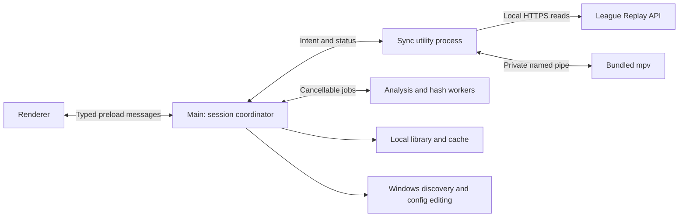

# League replay comms implementation plan

Updated: 2026-09-30. Status: agreed product scope; implementation in progress. Saved reviews, media previews, and experimental offline clock analysis have been built and tested locally. No current-League or clean-Windows acceptance gate has passed. See [implementation and validation status](tests/acceptance/STATUS.md).

This is the authoritative implementation plan. Implementation defaults can change when measurements justify it. Changes to user-visible scope or accuracy targets must be recorded explicitly.

Scope revision, 2026-09-30: the user rejected manual replay-file selection and replay-confirmation tasks. Remember timing by recording contents and audio track. Replay-to-recording links are an optional convenience only when automatic replay identification is validated; otherwise omit that feature and ask only for the recording. Schema 6 implements recording-based timing and preserves earlier replay-keyed data for recovery.

Implementation order: validate the packaged clock/player integration, complete synchronization and manual review, add the durable recording library, integrate automatic video alignment and guided setup, then validate the release on Windows. The milestones below define deliverables and exit criteria; a described feature is not a claim that it is already implemented.

For implementation, start with the [time model](#5-time-model-and-invariants) and [module interfaces](#4-processes-and-module-interfaces), then follow the [work packages](#implementation-work-packages). The [verification matrix](#13-verification-matrix) defines required coverage. Keep completed work and measured results in [validation status](tests/acceptance/STATUS.md), so this document remains the specification rather than a running test log.

Implementation reference:

- [User workflows](#2-user-workflows), [stack](#3-stack-and-repository-layout), and [process boundaries](#4-processes-and-module-interfaces).
- [Replay connection and identity](#6-replay-api-and-active-replay-identity), [playback synchronization](#7-synchronization-controller), and [video alignment](#8-import-and-automatic-video-alignment).
- [Saved recording timing and file identity](#9-library-and-file-identity) and [guided Replay API setup](#10-replay-api-setup).
- [Accuracy criteria](#11-diagnostics-and-acceptance-criteria), [implementation milestones](#12-implementation-milestones), and [open measurement decisions](#14-decisions-to-close-with-measurements).

The fixed design decisions are:

| Concern | Decision |
| --- | --- |
| Application | TypeScript/Electron on Windows; one portable executable with bundled runtime and media/OCR tools |
| Playback | League is the master clock; one mpv process plays the selected audio stream from either audio or video |
| Alignment | Automatic video-clock analysis with manual correction; manual anchoring for audio-only files |
| Time mapping | One constant recording-to-game offset for continuous, uninterrupted match recordings |
| Remembered reviews | Recording content identity plus track-specific timing, independent of filenames; automatic replay links only where validated |
| Setup | Detect configuration and connectivity separately; offer a backed-up edit on the user's action |
| Release | Demonstrate accuracy and usability on the packaged Windows application; no promise of mathematically perfect synchronization |

## 1. Product and scope

Build a portable Windows companion that plays recorded comms in sync with League's replay viewer. The user seeks, pauses, and changes speed in League; the companion follows those controls. Support continuous recordings of regular ranked/flex matches without pauses in the original match.

The application must:

- Run from one downloaded Windows executable, with all runtime dependencies bundled.
- Accept standalone audio and player POV video containing comms. Play the selected audio track directly from the original file.
- Automatically align video using its visible game timer, with manual alignment and corrections always available.
- Align audio-only files manually, without waiting for automatic analysis.
- Follow replay time, pause/resume, speed changes, forward/backward seeks, and repeated scrubbing without accumulating drift.
- Remember each recording's selected audio track, alignment, manual corrections, and known file locations.
- Recognize byte-identical recordings after renames, moves, or copies. Automatically restore a replay's recording only if a reliable automatic replay identity is available; this convenience is not a required feature.
- Detect Replay API configuration and help the user enable it, including an optional automatic config edit.

Outside scope: automatic audio-only anchoring, acoustic fingerprinting, speech recognition, recorder integration, recording-time metadata or sidecars, tournament-pause mapping, and edited/segmented recording timelines. These are not deferred milestones. A synchronized POV video player and simultaneous mixing of several audio tracks are not part of the first release; video frames are used for alignment and preview.

Never ask users to locate or confirm a `.rofl` file. Automatic replay identification must fail quietly to the recording chooser, without blocking playback setup or requesting additional permissions solely for match identification.

Use one constant recording-to-replay offset. Automatic alignment assumes the selected clock tick maps directly to replay time; it does not test the rest of the recording for consistency or drift. Manual correction remains available.

## 2. User workflows

The [guided UI design](UX_DESIGN.md) specifies the accepted finite-state flow with one current task and at most one primary action, including this revised identity policy. The guided UI and recording-based persistence are implemented.

### First review

1. Launch the executable. Detect the League installation, inspect Replay API configuration, and show connection status.
2. If needed, use **Enable replay connection** and restart the replay in League.
3. Connect to the open replay automatically. Optional background match identification may restore a known recording; lack of match identity adds no user task.
4. Drop or select a recording, or choose a recent recording. If it has multiple audio tracks and no saved choice, preview and select the comms track.
5. For video, run clock alignment and show progress. For audio, open manual alignment immediately. Manual alignment remains available while video analysis runs.
6. Once alignment is accepted, select **Start listening**. Bind the selected recording to this runtime session internally, follow League's controls, and save timing by recording/track locally.

### Manual alignment and corrections

The alignment view contains a waveform/timeline, recording playback and scrubbing, replay and recording timestamps, timestamp entry, **Align here**, and timing nudges. Show a video frame preview and clock crop selector when the source contains video.

Entering this view suspends following and gives recording playback to preview mode. It must remain possible to audition a recording without a connected replay. It does not pause or seek League automatically.

For **Align here**, the user pauses League at an identifiable moment and finds the corresponding recording position. Use the paused recording playhead and a fresh paused replay observation as the anchor. If either is advancing, require pausing or explicit timestamp entry instead of silently pairing observations from different instants. Timestamp entry supports a known game time even when the viewer is disconnected; following still requires a fresh connected replay and explicit listening intent for the current session.

Apply a manual anchor as `baseOffset = recordingSeconds - replaySeconds`, with manual correction reset to zero. **Advance comms by 10 ms** increases the effective offset by 0.010 seconds; **Delay comms by 10 ms** decreases it. Also provide 100 ms steps. This naming describes the heard result and avoids an ambiguous offset sign.

Applying an anchor or correction updates the session immediately. Leaving preview for following performs a fresh synchronization. A late automatic result must never overwrite a manual change. **Re-run automatic alignment** explicitly replaces the effective alignment only after a successful result; preserve the existing alignment if new analysis fails.

### Subsequent reviews

Choose or drop the recording, or select it from recent recordings. Verify its identity, restore its track and timing, and select **Start listening**. A renamed or moved file with matching contents reuses saved alignment. A missing recording shows **Locate file**. A validated automatic replay identity may select its known recording instead; never infer that match association from the last-used file or replay duration. Restored timing establishes a recording-to-game-clock mapping, not proof that the user opened the corresponding match in League.

## 3. Stack and repository layout

Use TypeScript, Electron, a bundled mpv process, FFmpeg/ffprobe, and Tesseract.js with local worker/WASM/language assets. Use electron-builder's Windows portable target. Pin dependency versions and native executable checksums when creating the build; record their licenses and distribution requirements.

Implementation defaults: a small React/TypeScript renderer built with Vite, Vitest for deterministic TypeScript tests, and a versioned JSON library owned by the main process. SQLite is unnecessary for the initial library size. These defaults do not change the agreed playback architecture.

Proposed layout; create directories only when their implementation lands:

```text
src/
  main/          App lifecycle, session coordination, dialogs, library ownership
  preload/       Narrow, typed renderer interface
  renderer/      Review, alignment, setup, and diagnostics views
  sync/          Utility-process entry, controller, replay and mpv adapters
  analysis/      Import, frame extraction, OCR, waveform, hashing workers
  library/       Records, migrations, identity, persistence, relocation
  platform/      Windows installation/process discovery and config editing
  shared/        Serializable messages, domain records, runtime validation
resources/      Bundled media executables, OCR assets, certificate, notices
scripts/        Verified dependency acquisition and packaging
tests/
  fixtures/      Generated media, config variants, and sanitized clock traces
  integration/  Real engine, persistence, IPC, and Windows helper tests
  acceptance/   Measurement tools and real-client test instructions/results
```

Do not copy prior-art source without establishing its reuse license. Implement behavior independently where necessary.

## 4. Processes and module interfaces

The synchronization utility process owns replay observations and every mpv playback command. Renderer timers, OCR, and hashing must not run the playback loop.



Keep each module's interface small. Its implementation owns lifecycle, ordering, cancellation, and error handling.

| Module | Interface responsibilities | Hidden implementation |
| --- | --- | --- |
| Review session | Select recording/track, enter preview, apply alignment, follow, stop; publish one session snapshot | Runtime generations, optional automatic match links, job coordination, persistence |
| Replay connection | Start/stop observations; report capabilities, playback samples, and connection errors | HTTPS trust, validation, polling, request deadlines, process-session changes |
| Synchronization | Consume timestamped observations and user intents; emit playback actions and status | Clock estimation, state transitions, jump detection, rate correction, recovery |
| Media engine | Load a track, observe position, pause/resume, set rate, seek, set volume, close | mpv lifecycle, pipe protocol, request IDs, event interpretation, timeouts |
| Media analysis | Probe, produce waveform/preview, estimate clock alignment, cancel; report progress/evidence | FFmpeg processes, OCR workers, crops, PTS conversion, fitting, cache |
| Library | Resolve recording identity/location, restore track/timing, commit alignment, relocate | Streaming hashes, provisional imports, deduplication, migrations, optional automatic match links, crash recovery |
| League setup | Discover installations, inspect config, enable on explicit user action, verify | Registry/process queries, encoding-preserving edits, backups, concurrent writes, elevation |

At the synchronization module's seam, use real adapters for Replay API/mpv and trace/fake adapters for tests. Give the controller a monotonic clock dependency; do not add interchangeable backends without a concrete use.

Messages carry a session generation, request/job ID, and relevant alignment revision. Validate payloads at process interfaces. The renderer can request supported actions, not execute arbitrary commands. Use Electron context isolation, a sandboxed renderer without Node access, and a restricted preload interface. Spawn bundled tools with argument arrays, not shell-interpolated filenames.

The main process owns shutdown and child supervision. A crashed sync process must not leave mpv playing indefinitely. Prove parent/child cleanup and pipe-loss behavior in the Windows probe, including abnormal exit. Terminate owned children only. Closing the application ends playback; minimizing it preserves following. Use one application instance to avoid competing playback and library writers.

## 5. Time model and invariants

All domain time values are finite seconds represented by numbers. Use explicit field names with `Seconds` suffixes and a monotonic clock for elapsed time. Wall-clock dates are only for logs and persistence. Replay and media sampling occur in the sync process's clock domain; do not compare raw monotonic timestamps from different processes without a defined translation.

| Symbol | Meaning |
| --- | --- |
| `g` | Replay API game time |
| `m` | Recording position in the media engine's timeline |
| `b` | Base recording-to-replay offset from OCR or a manual anchor |
| `c` | User's manual correction |
| `o = b + c` | Effective offset |
| `r` | Replay speed |

The mapping is `m = g + o`; nominal recording playback rate is `r`. An anchor at replay 10:00 and recording 10:45 sets `o = +45`. A recording beginning at game time 02:00 sets `o = -120`. Persist content alignment separately from measured output-device compensation and temporary drift correction.

Maintain these invariants:

- Only one owner controls mpv: following, manual preview, or idle. The sync process mediates all three.
- Following requires listening intent bound internally to the current runtime generation, loaded track, accepted alignment, and fresh replay state. Persistent match identity is optional; Start listening does not claim to verify the match.
- Pending/failed identity checks cannot silently authorize restoring an unrelated saved offset.
- A new replay, media file, or track invalidates outstanding seeks, analysis application, and relevant clock estimates.
- Stale messages and job results cannot change a newer session or alignment revision.
- A target outside the selected track's playable interval produces silence. Do not clamp to the start/end and play unrelated audio.
- Command acknowledgement is not proof of completed seeking or audible output.
- Persistent manual changes survive failed analysis, reconnects, and application restarts.

### Media timestamps

Choose mpv's tested normalized media timeline as the canonical recording coordinate. Explicitly convert FFmpeg frame presentation timestamps into that coordinate. Preserve audio/video relative start times; do not independently reset each stream to zero.

Define that conversion as `mediaSeconds = decodedPtsSeconds - mediaOriginSeconds`, where `mediaOriginSeconds` is the loaded engine's verified timestamp origin. Do not substitute ffprobe's container start time without a format-specific fixture establishing equivalence. Preserve integer PTS and the stream time base through decoding before conversion. The same conversion must drive previews, waveforms, OCR, manual anchors, and playback targets.

Validate conversion with generated files containing nonzero starts, negative preroll, deliberate A/V delay, and variable frame rate. Store the timeline-conversion version with cached analysis. Use actual decoded frame PTS, never frame number divided by nominal FPS or the requested extraction seek time. Track availability may differ from container duration; distinguish unavailable timestamps from a valid zero.

## 6. Replay API and active replay identity

Use read-only requests to `https://127.0.0.1:2999/replay/playback`. The reference implementation models `time`, `speed`, `paused`, `seeking`, and `length`; verify the current schema and transition semantics in milestone 1. Handle an absent/unreliable seeking flag using observed clock discontinuities. Missing essential clock fields produce an unsupported-client state, not fabricated values.

Use a dedicated loopback HTTPS client, persistent connections, bounded responses, and explicit deadlines. Configure trust for Riot's documented certificate and validate the actual setup; never disable certificate verification globally or allow redirects to arbitrary hosts. Distinguish config failures, TLS errors, unsupported responses, and an absent replay in diagnostics.

Start with a 50 ms polling interval (20 Hz), at most one playback request in flight, and no queued catch-up polls. Record monotonic send/receive times. Estimate a sample time from the request bracket while retaining uncertainty; its midpoint is not a guaranteed server timestamp. A separate watchdog expires stale state even if a request hangs. Poll process/session identity at connection and periodically at a lower frequency; do not query Windows process metadata 20 times per second.

The API's process ID is not a persistent replay identifier. Automatic identification is an optional, bounded background operation:

1. Obtain the game process ID from `/replay/game` where available.
2. Read Windows process executable path, creation time, and command-line information using structured queries. Validate executable/install identity and avoid logging unrelated command-line contents.
3. If the current League launch format reliably exposes a `.rofl` path, parse and verify that file, then hash its contents.
4. Otherwise return identity unavailable and continue to the recording chooser. Never expose a replay-file picker, saved-replay selection, or replay-confirmation task.

Treat PID plus creation time and a local generation as runtime identity only. On Start listening, associate listening intent with the current generation internally. Process replacement or an ambiguous reconnect stops that intent; retain recording timing and require an explicit Start/Resume listening action, not replay-file confirmation. A positively detected different match clears any automatic recording selection and resolves its own link or shows Choose recording. Normal seeks are not evidence of a new match. Matching clock progression or replay length cannot prove match identity.

If supported launch paths are validated against the current League client, full `.rofl` SHA-256 can key an optional automatic replay link. A trusted region/match ID is another possible key if actually available. Query only the relevant process, parse Windows arguments correctly, verify executable/path/file identity, and recheck session generation after hashing. Do not infer identity from the newest file, the last downloaded replay, or a launch request that may not describe the active viewer. Do not request elevation or scan unrelated process command lines solely for this convenience. If the experiment cannot demonstrate reliable identification, omit persistent replay links from the release.

The required baseline is the recording-only flow: select comms, restore its content-based timing, and Start listening to the current replay clock. It cannot automatically establish that the recording belongs to the viewed match; show the selected recording clearly without claiming a verified match.

## 7. Synchronization controller

### States

| State | Behavior and exit condition |
| --- | --- |
| Waiting for replay | Following is silent; retry with bounded backoff, resetting on success |
| Needs recording/alignment | Show the missing prerequisite; no automatic following |
| Preview | User controls the recording independently; replay observations continue |
| Following | Advance at nominal speed plus bounded drift correction |
| Paused | Audio paused; changed replay position still triggers a silent seek |
| Recovering | Suppress audio, establish the latest stable target, seek and verify |
| Outside recording | Silent until the target enters a playable interval, then recover |
| Error | Stop automatic output and offer a specific retry/recovery action |

Keep connection state, preview intent, and identity resolution as separate inputs rather than encoding every combination as another state. A replay disconnect must not unexpectedly seize deliberate preview controls. On return to following, check all prerequisites again.

### Steady playback

1. Validate and timestamp replay and media observations. Reject obsolete generations and observations outside freshness limits.
2. Detect pause, rate, and seek changes before steady-state interpolation. Do not extrapolate through a seek or across a state change.
3. During unchanged playback, project replay time to the comparison instant: `gNow = gSample + r * elapsedSeconds`. Use a constant time when paused and a short bounded extrapolation horizon when running.
4. Obtain the engine's audio position at the same instant as closely as its observation contract permits. Evaluate `audio-pts` as the driver-aware reference and retain `time-pos` for comparison. Notifications are asynchronous; timestamp receipt and bracket active queries.
5. Compute `error = desiredMediaPosition - observedAudioPosition`. Ignore errors within the larger of the tuned deadband and observation uncertainty.
6. For sustained small errors, apply bounded proportional rate correction, returning to nominal as error clears. Positive error means audio is behind and should advance faster. Start experiments with a 25 ms deadband and a maximum adjustment of ±2% of nominal rate.
7. If correction cannot return to the acceptance range promptly, perform one deliberate resynchronization. Repeated corrections without convergence enter recovery/error instead of an endless audible loop.

Begin with a 300 ms maximum age since the last trustworthy replay observation and an independent watchdog. Tune deadlines against the audible stop target, including buffered audio. Deadband, persistence windows, jump thresholds, and settling criteria are measured controller configuration, not scattered renderer constants.

### Pauses, jumps, and rate changes

On pause, stop audio promptly. On resume or rate change, reset prediction, apply the new rate with pitch preservation, and recheck alignment. At navigation speeds outside the validated listening range, suppress comms with a visible status and recover when a supported speed resumes; never play at an unrelated fixed speed.

Detect jumps from a validated seeking flag and the residual against the prior replay prediction. Account for polling jitter and rate transitions before classifying a jump. Correct smaller discontinuities through the ordinary error path; do not rely on a multi-second seek threshold.

Recovery sequence:

1. Suppress output, increment the playback generation, and keep only the latest desired target.
2. Wait for a fresh, settled replay observation. Determine settling from measured clock progression and seeking behavior, including paused seeks; a single flag is insufficient until validated.
3. Send an absolute precise seek to the mapped recording position. Serialize physical seek operations and coalesce new targets. A generation ID invalidates application results but does not cancel a command already executing inside mpv.
4. Observe engine restart/seek state and fresh position feedback. A pipe reply alone does not complete recovery. Correlate global engine events with current load/seek state; do not assume they carry application generation IDs.
5. Recompute the target because League may have advanced during decoding. Use a bounded retry/convergence policy established by the probe; remain silent with an actionable error if recovery cannot converge.
6. Resume only when alignment is within recovery tolerance, the latest generation still matches, and League is playing. Remain paused after a paused seek.

On API loss, replay stall, media EOF, output-device change, engine exit, or system resume, invalidate affected estimates and recover deliberately. Suspend/resume must not reuse an extrapolation spanning sleep.

Forward system suspend/resume events from Electron's main process to the sync
process. On interruption, invalidate playback generations, queued playback intents,
replay observations, and runtime listening intent before replacing the owned player.
Terminate it without waiting for an IPC acknowledgment during suspend. Check long
gaps in the utility's own timer before applying its parent-heartbeat deadline:
Windows clocks include sleep, and a timer can run before the resume notification.
Keep the ordinary orphan watchdog active after that interruption has been handled.

Serialize restoration behind previously accepted work. Reload the unchanged
recording paused, restore its stream identity, volume and preview position, and
verify source version and timeline origin before publishing it. Keep saved offsets
and corrections; require fresh replay observations and **Resume listening** before following again. Duplicate
or obsolete transitions must not restart playback. A failed restore must remain
silent and allow retry or explicit reopening of a recording. Use the same paused
restart path for **Retry playback** when the old media process is unavailable.

### Output-device recovery

Subscribe to mpv's `audio-reconfig` event and observe `current-ao` and
`audio-device-list` on every new IPC connection. Keep the event subscription even
when property observations are available: a default-device switch can retain the
same device list and driver name. Record the configured device and reported driver
as diagnostics, without presenting either as proof of the actual endpoint or
audible readiness.

On an unexpected reconfiguration, suppress output and invalidate pending output
observations and seek completions before recovery. Coalesce notifications for the
same recovery. Load, track selection, filter/rate changes, and explicit output
reloads can themselves emit this event; associate those expected notifications
with the bounded operation and verify its final state. Never restart the player
recursively in response to its own initialization events.

Verify the selected audio stream, usable output driver, fresh position, and paused
state before declaring restoration ready. A missing output or an unintended null
driver is an error even if the media clock advances. When no output exists, use a
bounded paused file reopen or player replacement; an `ao-reload` acknowledgment
cannot establish that an output was created. A failed attempt stays silent with
**Retry playback** available. Preserve the saved recording alignment and volume.
Initially permit at most two automatic output replacements in ten seconds; a
further failure stays silent and asks for a stable device and deliberate retry.
Explicit retry or reopening after failure resets that budget. Tune the limit from
device tests, keeping protection against an automatic restart loop.

Following may resume only after a fresh replay observation and verified seek to
the current target. Device-only recovery may retain a separately valid runtime
replay binding; an ambiguous session change requires **Resume listening**. Deliberate
preview remains paused until the user resumes it. Revalidate any measured device
latency compensation after a change instead of modifying the content offset.

Test expected versus unexpected notifications, duplicate bursts, events during
seek/replacement, absent output, failed restoration, and a default-device switch
with unchanged property values. Real Windows acceptance must also cover USB and
Bluetooth removal/reconnection, output-format changes, and physical audible
behavior; synthetic events and the null test driver cannot establish those results.

### Media engine configuration

Launch pinned bundled mpv with user configuration disabled, video rendering disabled, a private named pipe, explicit pitch correction, and shared audio output so League can also produce sound. Map ffprobe stream identity to the engine's actual track identifiers; do not assume their numeric IDs match.

Keep draining pipe events, bound pending commands, assign request IDs, and distinguish load success, seek acknowledgement, seek completion, and usable output position. Reject invalid/unavailable `audio-pts` during startup/seeking instead of converting it to zero. Preview defaults to 1× playback.

Start with default buffers and tune only when transition measurements justify it. Driver-aware timestamps may already account for buffering; do not subtract guessed latency twice. Residual device correction must be measured, separate from content alignment, and revalidated after device/rate changes.

## 8. Import and automatic video alignment

### Import jobs

Probe with ffprobe for streams, duration, timestamp origins, video dimensions, and audio metadata. Offer track previews when needed. A file without playable audio cannot serve as the comms recording even if its game clock is readable.

Run hashing, waveform generation, and video analysis as cancellable jobs outside the sync process. Playback/manual alignment can begin before hashing or the full waveform finishes. Bound CPU and I/O work, reuse OCR workers, and prioritize playback over cache completion. Changing media/track cancels or invalidates relevant jobs.

Decode sampled windows for OCR. For a waveform, stream selected-track PCM into fixed-resolution min/max buckets instead of retaining full-match PCM in memory. Cache derived data by content identity, stream identity, and algorithm/timeline version. Keep pending-import results provisional until full identity is established.

Begin with one heavy decode/OCR job and one streaming hash job at a time. Treat these as resource limits to measure, not accuracy requirements. Give interactive preview requests priority over queued analysis, limit each job's decoded-frame queue, and cancel obsolete child processes as well as their JavaScript promises. A worker crash or analysis timeout leaves manual review available. Report progress by stage and completed work; do not present a guessed percentage as a measured completion estimate.

### Clock alignment pipeline

Use one visible clock tick. The recording may start after game start, end before game end, or contain only a short part of the match; neither match boundary is needed.

1. Search short regions of the recording for a readable game clock. Begin at the recording start, then try distributed locations if the clock is missing or obscured. Stop searching as soon as one usable transition is found.
2. Use the supported normalized HUD crop, or the user's selected crop. Enlarge the crop and OCR digits/colon; require a complete `mm:ss` reading with valid seconds and confidence at least 40/100.
3. When sparse samples show the clock advancing by one second, narrow that interval. Request the actual next decoded frame after each candidate frame until two **consecutive frames** show `s` and `s + 1`. An unreadable intervening frame cannot be skipped when constructing the pair. Use actual presentation timestamps, including variable frame rates and nonzero stream origins.
4. Set `midpoint = (beforeMediaSeconds + afterMediaSeconds) / 2`. Assume that midpoint corresponds exactly to replay time `s + 1`, and set `offset = midpoint - (s + 1)`.
5. Apply and save the offset automatically, subject to the existing media/track/revision guards. Keep playback paused until the user selects **Start listening**. Offer **Adjust timing** for manual corrections.

For example, frames at recording times `1:05.030` and `1:05.040` showing `0:59` and `1:00` produce an anchor at recording `1:05.035` / replay `1:00`, hence offset `+5.035 s`.

There are no cross-recording consistency checks, holdouts, drift tests, minimum coverage requirements, or HUD/API phase-calibration gate. Search locations locate a tick; they do not validate each other. Only the chosen adjacent pair determines the offset. The midpoint-to-replay relationship is an explicit assumption, not a measured accuracy guarantee. Half the frame interval describes sampling resolution only.

Keep the 300-frame / 180-second work budget, cancellation, manual crop selection and manual alignment fallback. If no readable adjacent tick is found, return needs-attention and retain any saved alignment. Short footage containing no clock change cannot supply an automatic anchor.

Persist the two clock readings with their actual media timestamps, midpoint, method and algorithm version, crop, selected video stream, canonical origin, base offset and manual correction. Continue reading legacy saved alignment evidence without reinterpreting it as a consecutive-frame pair.

### Reuse and cache boundaries

Remember the selected video stream and normalized clock crop as a versioned media preference, including when analysis fails. Keep this preference in durable library data so cache eviction does not force the user to select the crop again. Promote provisional preferences after hashing using the same edit ordering as alignment changes.

Cache the two consecutive-frame OCR observations, not a previously applied offset. Key the cache by the verified media digest, video stream, canonical origin, analyzed interval, crop, sampling/timeline versions, and decoder/OCR resource identity. Recompute the midpoint from the cached pair. Increment the analysis version so old sparse-window observations cannot be reused as consecutive-frame evidence. An explicit re-run bypasses cached readings.

Validate file version before and after analysis or cache restoration. Evidence collected during hashing may be promoted only if the completed identity refers to the same unchanged source; handle either completion order. Use bounded, atomic, disposable caches with validated descriptors. Missing, corrupt, incompatible, or unwritable cache entries trigger fresh analysis or leave the in-memory result usable, without affecting saved manual alignment.

### Applying results

Each job captures media identity or provisional import ID, selected stream/track, media selection generation, and alignment revision. Replay-derived anchors also capture the runtime generation; pixel-only analysis does not require a replay identity. Apply a result only if its dependencies still match and no manual change occurred since that job started. Crop changes and explicit re-runs create a new analysis revision. Obsolete results may populate compatible caches but cannot update the active alignment.

Initial automatic analysis starts after recording content identification and saved recording/track timing reconciliation. It must not depend on replay identity or replace a saved manual offset still being restored. Preview, manual alignment, and an explicit **Read game clock** request remain available during hashing. A cancel/crop/manual action during identification suppresses that import's pending initial analysis.

Keep the previous accepted alignment while reanalysis runs. On successful initial alignment or an explicit re-run, store the new base offset and reset manual correction to zero as one revision; do not add an old correction to a newly accepted estimate implicitly. Provide manual adjustment for recorded microphone/picture delay; OCR cannot infer that from pixels.

Use the following precedence rules in the session coordinator:

| Incoming result or action | Required behavior |
| --- | --- |
| Verified saved recording/track timing, no newer edit in this session | Restore its selected track, base offset, and correction |
| Manual anchor or nudge | Apply immediately, persist the intent, and invalidate automatic application from older jobs |
| Initial OCR result after a saved or manual alignment has been accepted | Retain the accepted alignment; reuse compatible analysis evidence only |
| Explicit automatic re-run succeeds and its captured revision still matches | Replace the alignment in one commit and clear the previous correction |
| Explicit automatic re-run fails or becomes obsolete | Retain the accepted alignment and show the result without changing playback |
| Hashing discovers existing recording timing after a manual edit | Preserve the current manual intent for that exact media/track key; never let hash completion order select the winner |

Serialize user edits in the main process and assign an increasing edit sequence that survives provisional-import reconciliation. Use that ordering, recording/track identity, and revision checks when merging results; wall-clock timestamps and worker completion order are not conflict-resolution rules.

## 9. Library and file identity

### Records

Use a versioned library document with these logical records. Field spelling may follow code conventions while retaining the invariants.

| Record/key | Required data |
| --- | --- |
| Optional automatic replay link, keyed by validated replay identity | Preferred recording hash and audio track, provenance of automatic identity, revision; omitted when reliable automatic identification is unavailable |
| Media, keyed by SHA-256 | Byte size, known paths/file versions, probed streams, canonical timeline metadata, preferred audio track, selected video stream/crop and preference revision, analysis cache references |
| Recording timing, unique by media hash + audio stream identity | Base offset, manual correction, source (`manual` or `video-clock`), optional anchor/evidence reference, alignment revision, created/updated dates |
| Path observation | Path, volume/file identifier where available, size, modification/change timestamps, verified digest and verification date |
| Analysis cache entry | Media hash, relevant streams/crop, algorithm and timeline versions, evidence/result or derived-file location |
| Settings | Selected installation, user-added media folders, volume, diagnostic preferences; no recording-time metadata |

A track is identified within the content-hashed file, with stream index and relevant metadata validated against mpv when loading. Choosing another recording or track must not delete previous timing or corrections.

Remember each recording's preferred track independently of its alignment. Reopening an unaligned recording should restore its track with **Set an alignment** still required; it must not fall back to a previously aligned track. A late hash may reveal a saved track choice for a renamed recording. Restore that choice only if no newer track selection or manual anchor was made during identification.

The recording's content identity owns reusable analysis and location history. Recording hash plus audio track owns the offset and correction. This relies on the existing scope of one continuous, single-match recording with no original-match pauses. An optional replay link selects the recording; it does not own its timing. Encode timing keys as an unambiguous tuple of media hash and track identity.

Migrate the existing replay-keyed library without deleting legacy data: retain a recoverable copy; promote unique or equivalent timing records for a media/track pair; if multiple legacy records conflict, preserve them and require **Check timing** when that recording is opened. Do not choose an arbitrary replay's offset, and do not ask the user to select a `.rofl` to resolve the conflict. Existing manually asserted replay links are not verified automatic identities and must not authorize automatic selection.

### Hashing and restoration

Use streaming full-file SHA-256 in a background worker with bounded buffers and cancellable I/O. It reads all bytes but does not decode video. Do not block the UI or require completion before a new manual alignment can be auditioned.

Hashing time depends on file size and effective read/hash throughput, not recording duration: approximately `fileBytes / throughputBytesPerSecond`. Measure progress in bytes and estimate remaining time only after observing throughput. Hash once for a new or uncertain file version; reuse verified metadata for unchanged known files. Renaming preserves the digest, while a rename during an active read must still pass the file-version/path checks before that result can be committed.

During import, assign a temporary ID. Keep provisional alignment edits recoverable locally; after hashing, merge into the content-keyed record without losing a newer manual revision. Reconcile recording/track timing by its full key rather than replacing unrelated entries.

Remember a provisional recording path and track in recent recordings immediately, even before
an alignment or full digest is available. When that recording is reopened, compare
verified and provisional choices by their original edit revision. Resume the
latest unfinished import only if the original path still has its saved file
version, then restart identification and promote its edits normally. Recheck the
version after decoder loading, before applying a provisional offset. A missing or
changed unfinished file requires explicit reopening; do not restore its offset to
an unverified moved/replaced file or silently fall back to an older recording.

Record file versions before and after hashing. If the file changes, invalidate the result and retry or ask the user to finish writing the recording. Restore saved alignment from an unchanged, previously verified file-version cache. A new location or uncertain version requires full digest verification before automatic restoration. Metadata is a cache hint, not cryptographic proof; rehash when the cache cannot be trusted.

A size plus sampled-block signature may shortlist candidates but never authorizes restoration by itself. Editing container metadata, trimming, or transcoding changes the digest and creates another media identity. No perceptual matching is planned.

When a path is missing:

1. Try other verified known paths for that identity.
2. Search the last-known directory and configured media folders with bounded, cancellable traversal. Avoid junction/symlink cycles and unbounded drive scans.
3. Shortlist by size and optional sampled signature, then verify the full digest.
4. Otherwise show **Locate file**. A matching digest updates the path and restores alignment; a different digest is a new recording and cannot silently inherit the old offset.

A hash recognizes a discovered file; it cannot locate an arbitrary moved file on its own. The user locates recordings only; missing automatic replay identity never opens a `.rofl` locator.

### Persistence

Store library data and caches in a stable application data directory, independent of the executable's extraction path, name, or version. Use one writer in the main process and schema migrations. Caches are disposable; recording timing, manual corrections, and any optional automatic links are durable data.

Write a validated snapshot to a temporary file in the same directory, flush it, and commit with a tested Windows replacement procedure while retaining a recoverable previous snapshot. Validate on startup and recover from interrupted writes without discarding the last valid library. Test actual filesystem behavior rather than assuming rename provides every required guarantee. Never overwrite an unrecognized future schema.

Persist manual edits promptly and show unsaved/error state on failure. Bound caches and logs separately from library records. Eviction must never erase an offset or optional replay link.

For each update, clone the last committed state, apply and validate the transaction, write the recoverable backup and new snapshot, then publish the committed revision. On failure, retain the previous durable state and the unsaved session edit for retry. Completing an import must atomically promote its provisional identity, reconcile the latest applicable edits, and remove the pending import; a crash cannot leave the offset referring only to a deleted temporary ID. Exercise recovery both before and after the final replacement.

Retain failed-to-save drafts by recording/track or provisional-import key across selection changes; a single active-view field is insufficient. Applying the audible change and saving it are independent outcomes: a player error must not discard the edit, and a disk error must not prevent auditioning it. On normal exit, stop accepting edits, silence playback, drain already accepted commands and durable writes, then close workers. If saving still fails, show retry/discard choices rather than silently reporting success. Discard requires an explicit user action; disposable cache completion must not block exit indefinitely.

Include recording/track choices, clock regions, volume, media folders, and installation selection in the same visible save/retry/exit workflow. Keep their latest intended values available after a failed write. Retrying an older preference must retain its original revision so it cannot override a newer alignment or selection. Migrate existing association-based preferences without changing offsets or corrections.

## 10. Replay API setup

Detect installations using Windows installation records and running League process paths, validating known config-path candidates. Use fixed structured process/registry queries; verify them on current Windows/League. Support custom drives, multiple installations, and folder selection when discovery fails.

Inspect `[General]` / `EnableReplayApi` in the selected installation's `game.cfg`. Return enabled, disabled/missing, or unreadable/ambiguous, with the selected path. Probe runtime connectivity independently. Enabled configuration with no running replay displays **Waiting for replay**, not **API disabled**.

On the user's **Enable replay connection** action:

1. Show the target installation and intended `EnableReplayApi=1` change.
2. Read the file/version and parse while preserving encoding/BOM, line endings, comments, and unrelated bytes. Do not rewrite through a lossy generic INI serializer.
3. Add/update the key or missing section. Refuse conflicting duplicates or unrecognized encoding with specific manual instructions. Do not create replacement game configuration if the expected file itself is absent.
4. Back up original bytes and construct the smallest edit. Recheck the original version before committing and use a replacement/locking procedure that detects concurrent changes where the platform permits. If exclusive update cannot be established, ask the user to close the replay/client and retry rather than overwrite a possible concurrent write.
5. Handle locks/read-only files explicitly. Elevate only the narrowly scoped config write if required; ordinary review remains unelevated. Pass and revalidate the expected original digest and selected installation in the privileged operation.
6. Read back and confirm the setting. Show the backup location, instruct the user to restart the replay, and verify connection separately afterward.

If editing fails or elevation is declined, provide **Open config folder** and the exact manual change. Recheck configuration on later launches and installation changes. Keep backup restoration available without blindly overwriting later config edits.

The implementation uses a scoped PowerShell helper and Windows' existing runtime. It accepts only the selected root, one known relative config path, operation, inspected SHA-256, and optional backup ID. It computes the edit itself; the request cannot supply arbitrary replacement bytes. A digest passed separately binds the request across a delayed elevation prompt. The reviewing application stays unelevated.

Hold one `FileStream` with `FileShare.None` across source verification, backup, write, readback, and rollback. Reject reparse paths and, on Windows, verify the opened handle's final path and single-link identity. Flush the original `.bak` and transaction receipt before writing in place; do not release the lock to rename over a potentially changed file. In-place writing can be interrupted by process or power failure, so retain backups, attempt verified rollback on ordinary write failure, and expose manual recovery when the current file cannot be proven to match the completed edit. Automatic restore requires both matching current/receipt hashes and proof that enabling the backup produces the current bytes.

Reference: [Riot's setup reference](https://github.com/RiotGames/leaguedirector/blob/main/leaguedirector/enable.py).

## 11. Diagnostics and acceptance criteria

Separate source alignment error, controller/media position error, physical audible error, and transition response. A correctly controlled engine can play the wrong moment if its anchor is wrong.

Provisional release targets on documented Windows hardware and output devices:

| Measurement | Target |
| --- | --- |
| Audible error at steady 1× after verified alignment | Absolute error ≤100 ms for at least 95% of observations |
| Pause and speed-change reaction | ≤150 ms for at least 95% of transitions; measure speed-change settling separately |
| Final seek recovery | Back within the audible alignment gate ≤350 ms after replay picture/clock settles, for at least 95% of trials |
| Stale replay state | Invalidate following within 300 ms of the last trustworthy sample, including a hung request; measure audible stop separately |
| Repeated scrubbing | Latest target wins; no stale target resumes output; suppress audio during recovery |
| Full-match following | No unexplained accumulating drift or recurring correction loop |

These are targets, not established capabilities. Validate listening speeds 0.5×, 1×, and 2× plus explicit behavior at other navigation speeds. At non-1× rates, report media-timeline error and wall-time equivalent. Report p95, tails/maxima, missed deadlines, hard seeks, dropouts, and time muted. Classify transition windows explicitly; excessive muting cannot make a failing system pass steady-state metrics.

Measure automatic alignment separately against independent known anchors. Report absolute offset error, false acceptances, fallback rate, analysis duration, and uncertainty calibration. Self-consistent OCR is insufficient ground truth. Include samples where fallback is correct; no known incorrect match in that corpus may be silently accepted. Choose numerical OCR release thresholds from feasibility results and record them before final testing.

Keep bounded local traces of replay/media samples and age, request latency, intended/actual rate, state changes, seek generations, corrections, worker load, engine errors, output device, and build/client versions. Do not record comms or upload diagnostics automatically. Allow explicit diagnostic export with control over local paths.

Use generated audio markers for engine/controller tests, then original recordings and corresponding League replays for end-to-end tests. Capture replay reference and output audio together, accounting for measurement-path delay. WASAPI loopback alone does not establish downstream physical output latency; use physical loopback or external recording to certify the audible gate. Document the apparatus and sample counts.

The [timing measurement workflow](tests/acceptance/TIMING.md) provides a generated
marker recording, an annotation format, and a report command. Use its raw evidence
and uncertainty bounds alongside duration/dropout accounting. Fixture success and
descriptive sample percentiles do not replace independent review of real captures.

## 12. Implementation milestones

### Milestone 1: portable feasibility probe

Build the smallest packaged app that opens media, accepts a numeric offset, reads the replay clock, controls bundled mpv, and records timing traces. Include packaging paths for all planned native/OCR resources immediately.

Deliverables:

- TypeScript/Electron build, process supervision, narrow preload messages, and a Windows portable artifact.
- Basic Replay API/mpv adapters, clock tracing, manual offset controls, and an audible measurement harness.
- Current-client schema/seek/stall traces, ffprobe-to-mpv timestamp/track mapping fixtures, and audio-output observations.
- Installation discovery with the API disabled; bounded automatic replay identification experiment with recording-only fallback.
- Initial OCR samples and an original POV/replay comparison to characterize the midpoint assumption.
- A result document under `tests/acceptance/` listing tested versions, measurements, unresolved items, and initial controller/OCR parameters.

Exit: the exact artifact starts on a clean Windows machine and measurements establish a credible route to the timing gates. Resolve material clock, media-timeline, or packaging problems before the full workflow. Unavailable automatic replay detection uses the planned fallback and does not block the product.

### Milestone 2: synchronization and preview ownership

Implement controller states, time model, latest-target seeking, pause/rate following, drift correction, stale watchdog, output limits, and preview ownership. Test through the module interface with controllable time, jittered traces, and delayed/out-of-order replies. Integrate the real engine, including compressed seeks and child failures.

Exit: the probe meets measured following/recovery targets through a full replay session and remains responsive under synthetic analysis load. Manual preview and following cannot fight for playback control.

### Milestone 3: complete review workflow

Implement in this order:

1. Import/probing, stream selection, waveform/frame preview, manual anchor/nudge controls, and status/error actions.
2. Recording-based library schema/migrations, background hashing, provisional-import reconciliation, per-track timing, and file relocation; optional automatic replay links only if validated.
3. Video crop detection, consecutive-frame midpoint alignment, versioned cache, and manual-override protection.
4. Installation chooser, configuration inspection/edit/backup workflow, restart guidance, and diagnostics view.

Discovery experiments already exist from milestone 1; this milestone integrates them into the workflow. Modules can be developed independently, but persisted IDs, timeline conventions, and revision semantics must agree before integration.

Exit: a user can configure the connection, import/align either media type, review in League, close/reopen the app, and restore renamed or relocated media without a terminal or repeated alignment.

### Milestone 4: release validation and distribution

Automate Windows x64 builds with locked dependencies, verified native downloads, license/distribution materials, and artifact smoke checks. Include Electron, mpv, FFmpeg/ffprobe, OCR and trust resources; runtime dependency downloads are not allowed. Launch bundled tools independently of `PATH` and personal player settings. Prepare code signing for public distribution.

Keep dependency acquisition and notice preparation reproducible in `scripts/`.
Collect production npm notices plus explicit notices for code and models already
embedded in upstream bundles. Pin supplemental source URLs and checksums, record
their audited dependency versions, and preserve provenance qualifications. Generate
an offline notice page and a machine-readable inventory under `resources/notices/`;
packaging must reject missing, changed, or stale inputs. Preserve the previous
generated inventory if acquisition fails. Give users a fixed **Third-party notices**
action that works offline. Track complete corresponding-source and linked-component
coverage separately from the presence of license texts.

Verify the final portable payload as well as the staging directory: inspect archive
paths before extraction, reject unexpected entries, compare every extracted file
with the staged build, and bind the result to the executable's SHA-256. Include the
runtime libraries, native documentation, and generated notices in that comparison.
Keep the resulting verification record beside the artifact. Extraction does not
exercise the Windows launcher, DLL loader, config helper, or physical audio path;
those remain separate execution tests below.

Run the exact release artifact as a standard user on a clean supported Windows machine, including first launch without network access for dependency downloads. Verify persistence across executable renames/replacement and upgrades. The executable may unpack resources; library data must live outside that temporary location.

Exit: required automated and real-client checks pass, measured limits/tested versions are documented, and the downloadable executable completes the normal workflow without developer tools.

### Automated Windows validation

Provide one developer/CI entry point for Windows x64 validation. Run it as a
standard user in an interactive desktop session. The developer runner may need
Node and build tools; the resulting portable application must not require them.
Use a dedicated runner and serialize desktop jobs so tests cannot interfere with
each other's players, profiles, or output devices.

Run dependency/resource verification, type checks, deterministic and native
integration tests, the production build, desktop workflows, packaging, final
payload verification, and packaged execution in that order. Stop on failure.
Reject missing native-test coverage and unexpected skips instead of accepting a
green report from a smaller suite. Keep individual logs and machine-readable test
results, including pending stages after a failure.

The packaged workflow must launch the actual portable executable. Launching only
the extracted executable does not test extraction, forwarded arguments, or
launcher cleanup. For the pinned launcher, use separate loopback Node-inspector
and Chromium debugging ports with bounded endpoint discovery, then attach the
automation clients. Do not depend on child stderr reaching Playwright through
NSIS. Keep debugger ports exclusive to the test invocation; normal user launches
do not need them.

Give every run an explicit, isolated application-data directory and verify that
both Electron profile paths resolve there. Check the portable file's full digest
against its payload verification record before launch, then verify the running
executable and application archive against that same record. Refuse artifacts
that do not support profile isolation before starting them. Automation must never
fall back to a developer's ordinary saved-review library.

Exercise import, real bundled-player startup, track selection, manual alignment,
packaged offline OCR, notices, persistence, and restart after executable/media
renames in paths containing spaces and non-ASCII characters. Reuse the isolated
profile only for the intended restoration test. Verify normal exit and owned
child cleanup; bound startup, operations, and fallback termination.

Store evidence under `tests/acceptance/` or generated release-validation reports,
bound to the exact executable checksum, source/dependency versions, Windows
version, test commands, and outcomes. Distinguish automated portable execution
from clean-machine/offline first launch, real-League integration, and physical
audio timing. A successful automated run establishes only the cases it actually
executes; the latter gates still require their own evidence.

### Implementation work packages

Use these as dependency-ordered implementation tasks. File references identify the current module boundaries; finish missing behavior in those modules rather than creating a second implementation. A package is complete only after its acceptance evidence exists, even if its source code is already present.

| Package | Modules and concrete deliverable | Dependency and completion evidence |
| --- | --- | --- |
| 1. Portable foundation | `src/main/`, `src/preload/`, `src/shared/`, `scripts/`, `resources/`: typed IPC, validated commands, one app instance, bundled resources, child ownership, and portable packaging | First. Exact executable launches offline as a standard Windows user; no Node/npm or media-tool installation; owned children stop after exit/crash |
| 2. Replay observations and identity | `src/sync/replay.ts`, `src/platform/`, `src/main/review-session.ts`: trusted loopback requests, bounded polling, stale detection, runtime generations, listening intent, and optional validated automatic replay discovery | Requires package 1. Current-client traces establish field/seek semantics; recording-only following works without persistent replay identity; changed/ambiguous sessions stop old listening intent without requesting a replay file |
| 3. Player and synchronization | `src/sync/controller.ts`, `engine.ts`, `mpv-ipc.ts`: canonical timeline, selected-track playback, fresh clock comparison, latest-target recovery, pitch-preserving rates, and preview ownership | Requires packages 1–2. Generated media and real engine tests cover timestamp conversion and stale completions; Windows measurements establish transition and following behavior |
| 4. Manual review | `src/analysis/`, `src/main/preview-session.ts`, `src/main/review-session.ts`, `src/renderer/`: cancellable probing, track audition, waveform/still previews, explicit timestamp anchors, and 10/100 ms corrections | Requires package 3. Audio and video can be manually aligned; disconnected preview works; timing nudges have the specified sign; switching sessions cancels obsolete jobs |
| 5. Durable library | `src/library/`, `src/analysis/hash-*`, `src/main/alignment-edits.ts`, `src/main/quit.ts`: streaming SHA-256, provisional reconciliation, recording/track timing, relocation, legacy migration, optional automatic links, and save-error recovery | Requires packages 2 and 4. Restart, rename, move, duplicate import, changed content, conflicting legacy offsets, failed writes, and exit with unsaved edits preserve recording timing and newest accepted manual intent |
| 6. Automatic video alignment | `src/analysis/video-clock.ts`, `clock-fit.ts`, `ocr-*`, `src/library/clock-cache.ts`: bounded tick search, crop selection, consecutive-frame decoding, automatic midpoint alignment, cache validation, and revision-safe application | Requires packages 4–5. Real original-POV/replay pairs establish offset accuracy and false-acceptance behavior; unsupported cases fall back to manual review without changing an accepted alignment |
| 7. Guided connection setup | `src/platform/`, `src/main/league-setup.ts`, `src/renderer/setup.tsx`, `resources/scripts/`: installation discovery, independent config/connectivity status, scoped enable/restore, backup verification, and permission handling | Discovery starts in package 2; complete alongside packages 4–6. Windows tests cover byte preservation, locks, concurrent changes, elevation accepted/declined, and guarded restore; ordinary review stays unelevated |
| 8. Release validation | `scripts/`, `tests/integration/`, `tests/acceptance/`: repeatable Windows builds, native/resource integrity checks, notices and source obligations, signing preparation, user workflow tests, and audible measurements | Requires packages 1–7. Exact artifact completes the clean-Windows workflow and the documented timing gates; publish supported versions/devices and measured limits with its checksum |

Use deterministic tests for controller decisions and race conditions, real processes/files for adapter and persistence behavior, and the packaged Windows app for platform and audible claims. Assign each discovered failure to the responsible package and add a reproducer where practical. Do not add unrelated product features while closing these gates.

## 13. Verification matrix

| Area | Required cases |
| --- | --- |
| Controller | Normal progression, jitter/late replies, short/long jumps, paused seeks, rapid scrub, rate transitions, stale/hung requests, replay replacement, long-session drift |
| Engine/lifecycle | WAV/compressed audio; MP4/MKV tracks; exact seeks; delayed completion; pipe disconnect; startup/load/engine failure; output-device change; parent crash; sleep/resume |
| Timestamps | VFR, nonzero/negative timestamps, A/V start offsets, codec priming, track playable ranges, recording starting mid-match |
| OCR | Resolutions/HUD scales, compression, timer rollover, overlays/occlusion, missing clock, wrong digits/crop, loading screens, partial and short recordings, consecutive VFR frames, unreadable intervening frames, immediate acceptance without later checks, bounded search and automatic application |
| Analysis reuse | Rename/cache hit, restored crop without accepted alignment, changed stream/origin/crop/runtime, explicit re-run, corrupt cache, cache write failure, provisional identity completion in either order, source changed during analysis |
| Manual workflow | Audio-only immediately available, video fallback/crop adjustment, timestamp entry, nudge sign, edit during OCR, failed re-run retains alignment, preview/follow transitions |
| Library | Restart/upgrade, rename/move/copy/duplicates, missing file, same-name replacement, changed content, interrupted/concurrent hashing, provisional merge, track-specific offsets, interrupted writes/migration recovery, unsaved edits across switches and exit |
| Setup | Enabled/disabled/missing key, missing section/file, multiple/custom installations, malformed/duplicate config, encodings/line endings, permissions/locks, concurrent edits, elevation declined, backup/readback, enabled config without replay |
| Package | Offline first launch, standard user, spaces/non-ASCII/long filenames, minimization, concurrent analysis, corrupt/unsupported input, resource discovery, executable update/relaunch |

Run deterministic tests on normal development platforms and Windows integration/package tests on Windows. Real-client testing requires installed League, compatible replays, original recordings, and a documented output setup. Synthetic fixtures cannot certify current-client behavior or audible timing. Do not complete a milestone/release gate based solely on mocks or successful command logs.

## 14. Decisions to close with measurements

| Question | Where resolved | Required fallback/result |
| --- | --- | --- |
| Does playback state follow settled pictures accurately enough? | Milestone 1 replay traces/output capture | Validated settling/freshness rules, or revise approach explicitly before claiming accuracy |
| Can the active `.rofl` path be identified reliably without user intervention? | Milestone 1 Windows process experiment | Use automatic replay links only if validated; otherwise omit the feature and choose recordings directly, with no `.rofl` picker |
| How do FFmpeg PTS, mpv time, track IDs, and audible output relate? | Milestone 1 fixtures/output measurement | One tested conversion/observation contract; no guessed latency subtraction |
| How accurate is the midpoint-to-replay assumption? | Original-video/replay comparison | Characterize error; manual correction remains available without gating automatic alignment |
| Which controller/OCR thresholds meet acceptance? | Milestones 1–3 fixtures/real sessions | Versioned parameters with results; no silent relaxation of timing targets |
| Can parent failure leave native playback running? | Milestone 1 packaged lifecycle test | Tested ownership/cleanup before general use |
| Do recordings need a clock-rate term? | Long-match validation | Document unsupported drift or explicitly design/validate an extension; retain constant offset for conforming files |

Keep these as explicit implementation questions. They do not justify adding automatic audio anchoring, recording-time metadata, or other excluded features.
