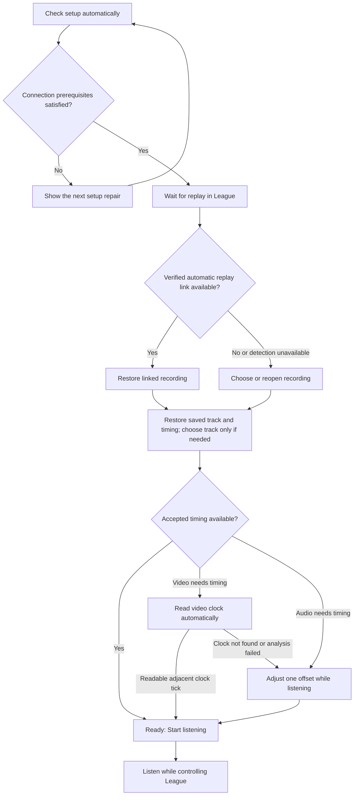

# Guided review design

Implementation: the production window now uses `GuidedWorkflow` in
`src/main/workflow.ts`. `src/renderer/main.tsx` renders the current task and
`src/renderer/timing-editor.tsx` retains the offset input during live edits. Schema 6 persists
recording/track timing without manual replay associations.

Accepted design direction, revised 2026-10-01: no manual replay-file selection or replay-confirmation task. Failed automatic clock detection goes directly to one live offset field with Back/Forward controls. There are no waveforms, timestamp pairs, frame previews, or clock-area selection. This specifies the implemented user flow. The [implementation plan](IMPLEMENTATION_PLAN.md) owns playback, recording identity, alignment, and accuracy requirements.

Replace the dashboard with one current task. Show one primary action when the user needs to act, and advance automatically when the application can do the work. Preserve access to changing a choice, cancelling work, and Settings without making them compete with the next step.

## Original problem

The original main view presented Replay, Recording, and Align and follow together. The prerequisite setup panel was collapsed. Users must discover the order themselves, interpret disabled controls, and distinguish several alignment methods. Playback recovery is hidden in Diagnostics. A video estimate requires copying a number into another section before applying it.

The redesign follows three established principles: one main action, questions only when relevant, and complexity revealed when needed. [GOV.UK button guidance](https://design-system.service.gov.uk/components/button/), [form structure guidance](https://www.gov.uk/service-manual/design/form-structure), and [NN/g progressive disclosure](https://www.nngroup.com/articles/progressive-disclosure/) support these principles. The particular sequence below is our design proposal; it still needs usability testing with players.

## The window

Use a compact, single-column window with a stable layout:

- Header: **League Replay Comms** and a quiet **Settings** button.
- Context: the selected recording and League connection status. Show match information only if automatically verified; do not invent champion/date metadata or expose an unknown match as a task to fix.
- Task: one heading, a short explanation, relevant input, and at most one emphasized action.
- Status: brief progress or connection information where it affects the task.

No permanent setup checklist, sidebar, marketing headline, raw controller state, or disabled future steps. Avoid a numbered “Step 2 of 7”: saved reviews and automatic detection skip different amounts of work. Use task headings such as **Choose your recording** to orient the user.

One primary action does not mean one interactive element. A file picker, track choices, preview playback, Back, and Cancel can support the current task. Ordinary selection controls must not unexpectedly start audio or move focus. Explicit action labels communicate when the app will proceed. See [W3C on predictable input](https://www.w3.org/WAI/WCAG22/Understanding/on-input.html).

## Normal flow



“Connection prerequisites satisfied” means either the relevant setup is verified or an independently trusted, usable replay connection already exists. An unknown installation path must not block an already working connection. Keep configuration and runtime connectivity as separate facts.

### State and action contract

| Situation | Heading and explanation | Primary action or automatic transition |
| --- | --- | --- |
| Initial discovery | **Checking League…** | Automatic; show progress, then the first unresolved task. |
| Installation missing | **Where is League installed?** Explain that the game folder is needed to check replay access. | **Choose League folder**. Validate the selection in place. |
| Several installations, no trustworthy active one | **Choose your League installation**. Show radio choices with paths. | **Use this installation**. Skip this state when the active installation is known. |
| Config is disabled | **Allow replay connection**. “This lets the app read your replay’s time. We’ll back up League’s configuration before changing it.” | **Enable replay connection**. This click authorizes the scoped edit; no duplicate confirmation. |
| Helper needs elevation | **Windows permission is needed**. Explain that only the configuration helper needs permission. | **Allow Windows permission**. Cancelling leaves this repair available without a loop of prompts. |
| Configuration enabled, no replay connection | **Open a replay in League**. “We’ll connect when it opens.” If the app just changed config while the viewer was running, say **Close and reopen the replay in League**. | No artificial completion button. Detect the connection automatically. A quiet **Connection help** opens targeted troubleshooting. |
| Match identity unavailable | No separate screen, warning, or user task. | Continue to Choose recording; do not offer replay-file selection. |
| Recording missing | **Find your saved recording**. Name the missing file. | **Locate recording**. Verify its contents before restoring timing. |
| No recording | **Choose your recording**. “Select the audio or video containing your team’s comms.” | **Choose recording**, with equivalent drag and drop and recent recordings. Choosing a recent item restores its content-based settings. |
| Recording opening | **Opening recording…** | Automatic. File identification runs in the background where safe; do not freeze preview or manual alignment. |
| Several audio tracks, no saved choice | **Which track has the comms?** Show tracks with short preview controls. | **Use this track**. Selecting a radio item alone does not advance. A single playable track is selected automatically. |
| Video needs alignment | **Finding the game clock…** | Automatic analysis. **Align manually** remains a secondary escape. |
| Clock cannot be read or analysis fails | **Adjust timing**. Explain briefly that automatic detection failed. | Open the live offset editor; **Done** returns to review. |
| Audio-only or manual fallback | **Adjust timing**. Listen alongside the replay and move the recording back or forward. | **Done**; see the manual flow below. |
| All playback prerequisites met | **Ready to listen**. Show the recording. “Comms will follow playback, pauses, and jumps in League.” | **Start listening**. Internally attach listening intent to the current viewer generation. Persistent match identity is not required. |
| Following | **Following League**. Show the replay time, rate, and volume. | No required next action. **Stop listening** is the single prominent control; **Adjust timing** is secondary. |

There is no replay picker or replay-confirmation screen. API process ID plus Windows process information may identify the replay automatically. Support automatic replay-to-recording links only if that path is validated against the current client; unavailable identity skips the convenience entirely. Never infer a match from the newest replay file, last-used recording, or similar duration.

The returning flow is **choose the recording → restore its track and timing → Start listening**. The recording is recognized by content hash after renames or moves; its offset belongs to the recording and audio track. If reliable automatic replay identification supplies an existing link, skip the recording chooser too. Do not replay first-run setup. Without automatic identity, the app follows the active clock and does not claim to verify that the selected recording is from the same match.

## Alignment without a control panel

### Video

Start clock analysis automatically for a new video, using the top-right timer region. Show a real stage such as **Finding a clock tick…**, not invented percentage progress. Measurable byte/frame progress can be shown where it reflects the actual work. Preserve manual editing and offer cancellation during slow analysis. [Microsoft progress guidance](https://learn.microsoft.com/en-us/windows/apps/develop/ui/controls/progress-controls) distinguishes measurable progress from indeterminate activity.

When two consecutive frames show the game clock advancing one second, map their midpoint directly to the new game second and go to Ready. Do not ask the user to confirm the estimate. No consistency check, holdout, minimum recording coverage or phase profile is required; the recording can start late or end early. **Adjust timing** remains available. Playback still requires **Start listening**.

If no readable adjacent tick is found or analysis fails, open manual alignment directly. Do not display video frames or ask the user to select a clock region. Preserve any saved timing when analysis fails. The [implementation plan](IMPLEMENTATION_PLAN.md#clock-alignment-pipeline) defines the midpoint assumption and evidence format.

### Manual alignment and live corrections

**Adjust timing** contains one **Recording offset (seconds)** field. Start at the saved effective offset, including any legacy correction, or zero for an unaligned recording. Positive values start further into the recording; negative values start earlier.

Place **− Back 0.1 s** and **+ Forward 0.1 s** together below the field. These move the recording backward or forward against the replay. Arrow Down/Up do the same. Shift changes the step to 1 second; Alt changes it to 0.01 seconds. Explain these shortcuts in a quiet hint, without another mode or step selector.

Valid edits apply and save immediately. Keep the field responsive across clock ticks and delayed saves, including incomplete negative or decimal input. Display failed saves with the existing retry flow. Do not show pending writes as failures. There are no waveform, scrubbing, timestamp-pair, or separate correction controls.

Opening the editor preserves an active listening session. **Start listening / Stop listening** controls replay-following in place; **Done** returns to review without changing that intent. A first offset of zero is valid, but must be accepted before Start or Done. Opening the editor and changing its value never start audio by themselves. Pause and seek League directly.

Offline users can enter and save the same offset. Explain that connecting to League is required to hear adjustments. A disconnect retains the input and requires an explicit Start after reconnecting. Late automatic results cannot replace accepted manual edits. **Settings → Read game clock again** restarts detection and pauses listening.

## While listening and recovering

The listening screen is small: recording, **Following League**, replay time, volume, **Stop listening**, and **Adjust timing**. It has no duplicate replay transport or always-visible waveform.

Pause, seeking, resynchronizing, and outside-recording conditions are status variations within this screen. They do not navigate the user back through setup. For example: **Replay paused**, **Catching up after a jump…**, or **This recording starts at game time 02:00**. Do not label these as errors.

| Interruption | Response |
| --- | --- |
| Brief loss of clock samples | Silence comms and show **Reconnecting to League…**. Recover automatically only if the existing runtime generation/listening intent remains valid. |
| Process replaced or ambiguous reconnect | Retain recording/timing and return to Ready with **Resume listening**. This deliberately starts a new runtime binding; it is not a statement of verified match identity. No replay-confirmation question. |
| Different match positively identified | Stop old listening intent. Restore that match's recording only through a verified automatic link; otherwise show Choose recording. |
| Missing or moved recording | Find it automatically where supported; otherwise show Locate recording. A hash mismatch means a different file and must not inherit the old offset. |
| No audible output / player failure | Show **Audio could not start** and **Retry audio** on the current task. Keep diagnostics secondary. |
| Replay speed unsupported | Stay on the listening screen, silence comms, and instruct the user to choose a supported speed in League. Resume when valid. |
| Config busy | Explain which prerequisite is blocking the edit; **Try again** retries only that edit. Do not kill League. |
| Several configs, malformed config, TLS/protocol failure | Show the specific connection repair/help state. Do not offer an unsafe generic Enable button or pretend no replay is open. |
| Library save failed | Keep valid in-memory playback usable. Show **Changes not saved** beside review context with a subordinate **Retry saving** action. Do not claim the changes were remembered. At exit, preserve the existing retry/cancel/discard protection. |
| Slow or failed background identification | Keep track preview and manual edits available. Block only identity-dependent restoration or saving; explain that restriction at the affected action. Never apply an unverified saved association. |

Errors replace the task's explanation and action only when they prevent that task. Do not collect unrelated errors into a top-of-window wall of messages. Preserve valid input after retry. An unresolved wait gains troubleshooting and a manual-preparation escape; it never reports success merely because time passed.

## Settings and optional work

Settings contains League installation, connection details, configuration backups, recording search folders, output information, diagnostics/export, and third-party notices. Required repairs still appear in the main flow when they become relevant. **Advanced** must never hide the action necessary to proceed.

**Change recording** is a quiet action on the established context. It enters a focused picker; cancelling preserves the current review. Confirming a change invalidates only facts that depend on it. Replays are opened and changed in League; there is no companion replay-file picker.

Keep **Prepare a recording without League** as a secondary option on connection waiting/help. It enters the recording/alignment branch deliberately. An automatic connection event must not eject a user from preview or overwrite their input. Following still requires all replay prerequisites.

## Finite state machine

Use one workflow machine in the main process to own the current task, user intent, and legal transitions. Keep the existing synchronization controller for millisecond playback behavior. Its state is an input to the workflow; it is not the navigation model.

Seven parent states are sufficient:

| Parent | Relevant substates |
| --- | --- |
| `checking` | Discover installation/config, restore library facts |
| `setup` | Choose folder/installation, enable, edit in progress, permission, repair |
| `replay` | Await viewer, connection repair; optional automatic identity is background work and never a user task |
| `recording` | Choose, open, locate missing file, choose track, media repair |
| `alignment` | Analyze, manual editor |
| `ready` | Valid review awaiting explicit start, or stopped review |
| `listening` | Following, replay paused, resynchronizing, outside recording, reconnecting, output repair |

Persist durable domain facts, not the current screen name. Configuration, runtime generation, optional automatically verified match identity, recording identity, track, alignment revision, and unsaved changes form context. Recording hash plus audio track owns saved timing. On launch, revalidate facts and choose the next unresolved prerequisite. Use a separate `prepare`/`listen` intent to support disconnected preparation.

Recommend a typed TypeScript transition module with an explicit event union and effect descriptions, fitting the current stack. A new FSM dependency is optional; XState is useful if actor/statechart tooling becomes valuable, but is not required for this flow. The concepts of guarded transitions, nested states, and state-scoped async work are documented by [W3C SCXML](https://www.w3.org/TR/scxml/) and [XState invocation](https://stately.ai/docs/invoke).

Proposed seam:

```ts
transition(workflow, event): { workflow: Workflow; effects: Effect[] }
present(workflow): WorkflowView
```

`WorkflowView` supplies the task ID, structured data, progress, one optional primary action, secondary actions, and review status. The renderer owns presentation and unsubmitted field input. The main process validates submitted data and allowed actions again. Do not infer navigation from prose error messages or duplicate `canFollow` conditions throughout React.

Implementation rules:

1. Route automatically at stable task boundaries. Do not run a global redirect on every clock tick or replace a manual editor when background discovery completes.
2. Check setup before connection only when setup is actually needed. A trusted live replay connection can satisfy the connection prerequisite without a discovered folder.
3. Start work on state entry; completion/error events leave the state. Explicit cancellation invalidates the job. Worker completion carries workflow generation, replay/media identity, track, and alignment revision as applicable.
4. Ignore obsolete completions. Changing media or manually editing timing prevents an older OCR result from becoming active.
5. Never silently enable configuration, start audible preview, or begin following because detection completed. Preview and Start listening are explicit user actions.
6. On Start listening, recheck fresh replay data, playable track bounds, loaded media, accepted alignment, and usable output; bind the submitted listening intent to the current runtime generation. Persistent replay identity is not a guard. Stale buttons cannot bypass these checks.
7. Retain facts and drafts through local errors; route only to the repair that is now required. Save status and background hash progress are parallel facts, not mandatory wizard steps.
8. Automatic recovery preserves the user's listening intent only within a still-valid runtime generation. Ambiguous reconnect, explicit Stop or power-session invalidation requires Start/Resume listening again. No manual replay association is introduced during recovery.

Shared snapshots expose the workflow view alongside setup, library, analysis, and playback state. Those modules remain responsible for their effects. The recording-based library migration removes the persisted replay requirement; this is implemented beyond the renderer.

## Implementation sequence and acceptance

1. Add the workflow transition/presentation module and event contract. Define all required repairs and guard ordering before wiring screens.
2. Replace the permanent renderer panels with the task frame. Connect setup and runtime detection, preserving explicit edit permissions and backups. Remove manual replay commands and following's dependency on a persisted replay hash.
3. Migrate recording/track timing and recent recordings, preserving conflicting legacy offsets for checking. Add restoration/import/track tasks, then expose one live offset with Back/Forward controls. Apply detected midpoint timing automatically; save manual edits immediately.
4. Add the compact listening screen, contextual recovery, Settings, and offline preparation. Update the review automation to drive user tasks rather than old panel labels.
5. Exercise transitions and real UI paths; then observe unfamiliar players completing a first video review, returning review, audio-only alignment, and missing-file recovery without coaching.

Acceptance criteria:

- At most one emphasized action in the current task; zero mandatory clicks for automatic detection/analysis or passive waiting.
- Completed prerequisites are skipped. There is no repeat first-run wizard, replay-file picker, or replay-confirmation screen.
- A user can identify the next step from the heading and action without opening documentation.
- Single-track video does not prompt for track choice. A saved recording/track/alignment does not prompt for re-entry.
- A readable adjacent clock tick applies timing automatically without confirmation. Recording identity, clock freshness, job generations, and persistence remain guarded; playback does not require persistent match identity or claim a verified recording-to-match pairing.
- Manual work survives disconnects, new background results, retries, and failed saves.
- Recovery never requires opening diagnostics. No endless wait without contextual help or an alternative path.
- All actions work with keyboard alone. Manual alignment requires no dragging. Inputs have labels; focus is visible and returns sensibly after dialogs.
- Meaningful state changes are announced through a status region; replay ticks are not announced repeatedly. Move focus to the task heading after deliberate navigation, and do not steal focus during editing. See [W3C status messages](https://www.w3.org/WAI/WCAG22/Understanding/status-messages.html) and [focus order](https://www.w3.org/WAI/WCAG22/Understanding/focus-order.html).
- Verify contrast, text scaling, keyboard behavior, and screen-reader announcements in the packaged Windows application.
